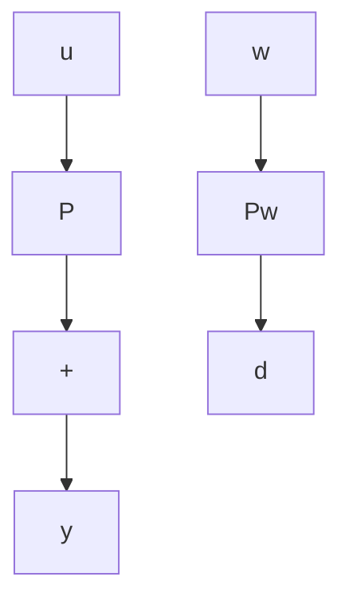
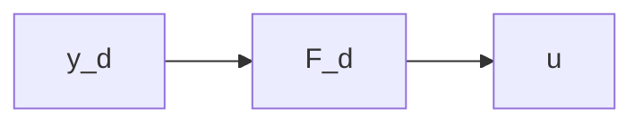
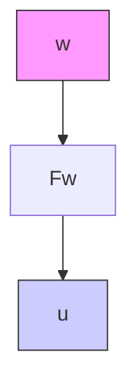

If the controller is LTI, then, by linearity, its output u is a combination of its three inputs, so that $\mathbf{u}(s)$ satisfies an equation of the form

$$\mathbf {u} (s) = F _ {d} (s) \mathbf {y} _ {d} (s) + F _ {m} (s) \mathbf {y} _ {m} (s) + F _ {w} (s) \mathbf {w} _ {m} (s). \tag {4.4}$$

Not all three inputs need be used. Several control structures are defined according to whether $y_{d}$ , $y_{m}$ , or $w_{m}$ is used to produce u.

Figure 4.3 shows the controller structures to be studied in this chapter. Open-loop control uses only $y_{d}$ (Fig. 4.3a); it corresponds to $F_{m} = F_{w} = 0$ in Equation 4.4. Feedforward control (Fig. 4.3b) is obtained by setting $F_{d} = F_{m} = 0$ . Feedback control (Fig. 4.3c and d) uses both $y_{d}$ and $y_{m}$ . In Figure 4.3c, $F_{m}(s) = -F_{d}(s)$ , so that $\mathbf{u} = F_{d}(s)[\mathbf{y}_{d}(s) - \mathbf{y}_{m}(s)]$ ; that is known as single-degree-of-freedom feedback control. Figure 4.3d has the same feedback structure but allows the designer the independent choice of $F_{d}$ or $F_{m}$ ; hence the name two-degrees-of-freedom feedback control. Combinations of the four structures are possible—for example, open loop with feedforward.

Figure 4.4 shows the system of Figure 4.1 in block-diagram form. For simplicity, it has been assumed that the measurement of w is noise-free. The system (within the dotted box) is seen to have three external inputs: $y_{d}$ , w, and v. By linearity, all signals in the system are generated by superposition, as

$$\mathbf {y} (s) = H _ {d} (s) \mathbf {y} _ {d} (s) + H _ {w} (s) \mathbf {w} (s) + H _ {v} (s) \mathbf {v} (s) \tag {4.5}$$

flowchart

Figure 4.2 Collecting all disturbances into a disturbance referred to the output

flowchart

(a)

flowchart

(b)
