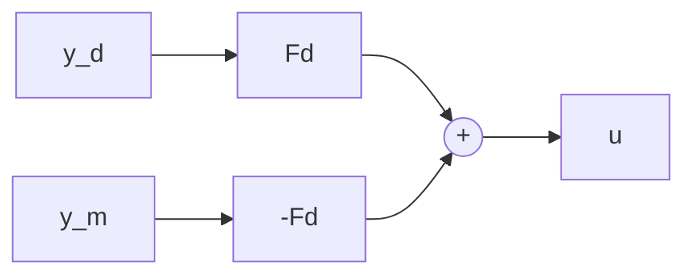
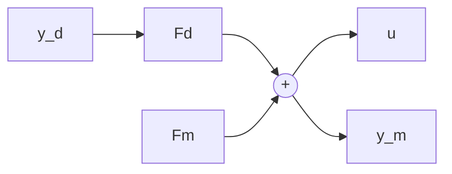
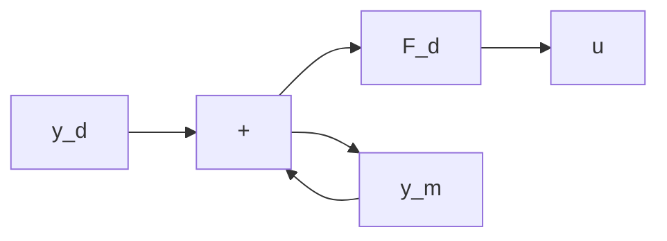
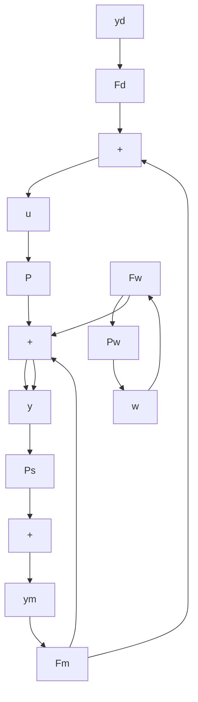

flowchart

or

flowchart

(d)

flowchart

(c)   
Figure 4.3 Control configurations: a) Open loop; b) Feedforward; c) Feedback, one degree of freedom; d) Feedback, two degrees of freedom

flowchart

Figure 4.4 Block diagram for a linear control system

where

$$H _ {d} = \text { set point to output closed - loop transfer function }H _ {w} = \text { disturbance to output closed - loop transfer function }H _ {v} = \text { sensor noise to output closed - loop transfer function. }$$

The error, defined as $\mathbf{e} = \mathbf{y}_d - \mathbf{y}$ , satisfies

$$\mathbf {e} (s) = [ I - H _ {d} (s) ] \mathbf {y} _ {d} (s) - H _ {w} (s) \mathbf {w} (s) - H _ {v} (s) \mathbf {v} (s). \tag {4.6}$$

The transfer functions $H_{d}$ , $H_{w}$ , and $H_{v}$ depend on the transfer functions of Equations 4.1, 4.3, and 4.4, associated respectively with the plant, the sensors, and the controller. The functional relationship depends on the controller structure. It is precisely this dependence that makes the study of different control schemes important and interesting. The design problem is to obtain $H_{d}$ , $H_{w}$ , and $H_{v}$ with desirable properties via an appropriate controller design, i.e., by choosing the structure and dynamics of the controller.

In cases where it is convenient to work with d, the disturbance referred to the output, rather than with w, Equation 4.5 is replaced by
