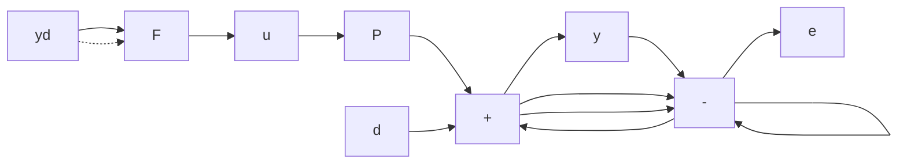

# 4.3.1 Basic Ideas and Expressions

In open-loop control, the manipulated input is derived from the set-point function $y_{d}$ only, as shown in Figure 4.10; this corresponds to the case $F_{m}(s) = F_{w}(s)$ in

Equation 4.4. More often than not, $y_{d}(t)$ is supplied as a function in a computer, so that open-loop control requires no measurements. From Figure 4.10 it follows directly that

$$y = F P y _ {d} + d \tag {4.13}$$

and

$$e = (1 - F P) y _ {d} - d. \tag {4.14}$$

With reference to Equation 4.7, for the open-loop structure,

$$H _ {d} (s) = F (s) P (s) \tag {4.15}H _ {w d} (s) = 1. \tag {4.16}$$

Perfect tracking of $y_{d}$ occurs if $H_{d}(s) = F(s)P(s) = 1$ , i.e., if $F(s) = P^{-1}(s)$ . The practical objective is to make $F(j\omega)P(j\omega) \approx 1$ in the system passband, i.e., the frequency range over which $y_{d}$ has significant spectral content. Since $H_{wd}(s) = 1$ , open-loop control does nothing to attenuate the effects of disturbance inputs; the best that can be said is that it does not amplify them, either.

The sensitivity of $H_{d}(s)$ with respect to $P(s)$ is calculated from Equation 4.11. Since $\Delta H_{d} = F(P_{0} + \Delta P) - FP_{0} = F\Delta P$ ,

$$S _ {d} ^ {P} (s) = \frac {F \Delta P / F P _ {0}}{\Delta P / P _ {0}} = 1. \tag {4.17}$$

A sensitivity of 1 implies that a given percent change in $P(j\omega)$ translates into an equal percent change in the transmission $H_{d}(j\omega)$ . Open-loop control neither decreases nor increases sensitivity.

flowchart

Figure 4.10 An open-loop control system
