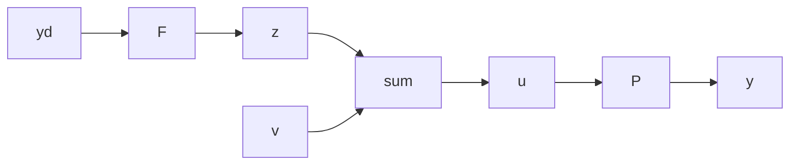

# ■ Theorem 4.1

Assume that $F(s)$ and $P(s)$ are realized by controllable and observable state representations. Then the system of Figure 4.11 is controllable and observable.

Proof: The proof relies on the basic definitions of controllability and observability rather than on the tests of Chapter 3. Let $\mathbf{x}_F$ and $\mathbf{x}_P$ be the states of the realizations of $F(s)$ and $P(s)$ , respectively. The state of the composite system is $\mathbf{x} = \begin{bmatrix} \mathbf{x}_F \\ \mathbf{x}_P \end{bmatrix}$ .

Controllability: The system is controllable if, starting from the zero state, there exist input functions $y_{d}^{*}(t)$ and $v^{*}(t)$ such that $\mathbf{x}_F(T) = \mathbf{x}_F^*$ and $\mathbf{x}_P(T) = \mathbf{x}_P^*$ , for all $\mathbf{x}_F^*$ , $\mathbf{x}_P^*$ , and $T > 0$ . Since the realization for $F$ is controllable, some $y_{d}^{*}(t)$ will take $\mathbf{x}_F$ to the desired value at $T$ . In the process, an output $z^{*}(t)$ will be generated.

By the same token, since the realization for $P$ is controllable, there exists a $u^{*}(t)$ that takes $\mathbf{x}_P$ to $\mathbf{x}_P^*$ at time $T$ . Now, $u$ is not an input of the system of Figure 4.11 but an internal variable. The output of the first block, $z^{*}(t)$ , contributes a part of $u(t)$ . We need only add $v^{*}(t) = u^{*}(t) - z^{*}(t)$ to ensure that $u(t) = u^{*}(t)$ and $\mathbf{x}p(T) = \mathbf{x}_p^*$ . Since there exist inputs $y_d^{*}(t)$ and $v^{*}(t)$ capable of taking the system to any desired state, the system is controllable.

Observability: It is necessary to show that, given $z(t)$ and $y(t)$ , $0 < t \leq T$ , for a zero-input solution with arbitrary $\mathbf{x}_{F}(0)$ and $\mathbf{x}_{P}(0)$ , it is possible uniquely to recover $\mathbf{x}_{F}(0)$ and $\mathbf{x}_{P}(0)$ . Let $y_{d}(t)=v(t)=0$ (zero inputs). Since the realization for F is observable, and since the input to F is zero, $\mathbf{x}_{F}(0)$ is obtainable from observation of $z(t)$ . Since $v(t)=0$ , $u(t)=z(t)$ and both the input and output of P are available, guaranteeing unique recovery of $\mathbf{x}_{P}(0)$ since the realization of P is observable. The composite system is thus observable. ■

flowchart

Figure 4.11 Open-loop system with additional input and output

The next step is to derive the stability conditions.
