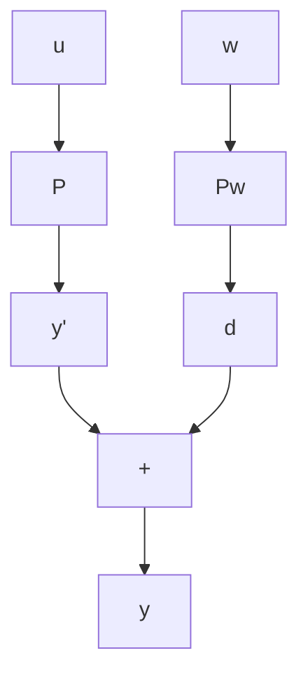
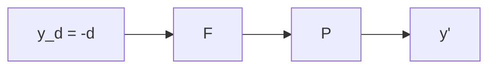
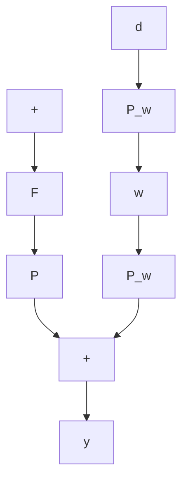

# Example 4.4 (Level Control)

In the level-control system of Example 2.8, the transfer function from the valve stroke u to the level is $\Delta\ell/\Delta u = (-2.0)/(s + .005)$ , and the transfer function relating the disturbance input to the level is $\Delta\ell/\Delta F_{in} = 1/(s + .005)$ . Design a feedforward compensator to cancel out the effect of the disturbance.

flowchart

(a)

flowchart

(b)

flowchart

(c)   
Figure 4.14 Development of the feedforward system

Solution The plant is stable and minimum-phase, so we pick $H_{d}(s) = 1$ , and therefore

$$F (s) = \frac {s + . 0 0 5}{- 2}.$$

The final step is to generate $y_{d} = -d$ , or

$$y _ {d} = \frac {- 1}{s + . 0 0 5} \Delta F _ {\mathrm{in}}$$

and therefore

$$\Delta u = F (s) y _ {d} = \frac {1}{2} \Delta F _ {\mathrm{in}}.$$

In this simple case, feedforward control requires the valve to open immediately upon sensing a change of flow into the tank. If the models are exact, the compensation is perfect.
