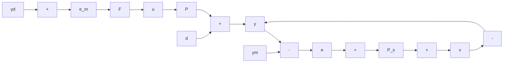
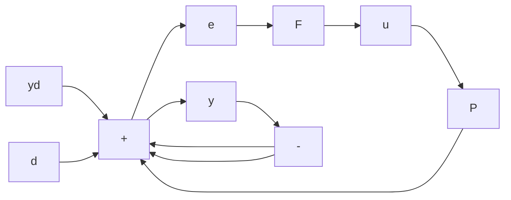

# 4.4.1 Basic Ideas and Expressions

Figure 4.15 shows the basic configuration for 1-DOF control. Since feedback is used, the control input u is generated from $e_{m}$ , the measured error, the difference between the desired output $y_{d}$ and the measured output $y_{m}$ . The transfer function $P_{s}(s)$ represents the sensor dynamics; the noise v represents additive sensor errors, such as bias and random noise. The dotted line is not part of the actual system but serves to define the error e between $y_{d}$ and y.

For the time being, the sensor is assumed to measure y exactly, so $P_{s}(s)=1$ and v=0. This leads to Figure 4.16. From that figure,

$$
\begin{array}{l} y (s) = F P e (s) + d (s) \\ = F P [ y _ {d} (s) - y (s) ] + d (s) \\ \end{array}
$$

so that

$$y (s) = \frac {F P}{1 + F P} y _ {d} (s) + \frac {1}{1 + F P} d (s) \tag {4.26}$$

and

$$
\begin{array}{l} e (s) = y _ {d} (s) - y (s) \\ = \frac {1}{1 + F P} y _ {d} (s) - \frac {1}{1 + F P} d (s) \tag {4.27} \\ \end{array}
$$

flowchart

Figure 4.15 Block diagram for a l-DOF feedback system

flowchart

Figure 4.16 Simplified block diagram for a 1-DOF feedback system

In terms of Equation 4.5, for the 1-DOF system,

$$H _ {d} (s) = \frac {F P}{1 + F P} \tag {4.28}H _ {w d} (s) = \frac {1}{1 + F P}. \tag {4.29}$$

The transfer function $F(s)P(s)$ is called the loop gain. If $|F(j\omega)P(j\omega)| \gg 1$ , then

$$\frac {F P}{1 + F P} \approx 1\frac {1}{1 + F P} \approx \frac {1}{F P}. \tag {4.30}$$

A high loop gain is therefore desirable at frequencies in the passband, since it makes $H_{d} = y / y_{d}$ approximately equal to 1 and $H_{wd} = y / d$ small.

If $|F(j\omega)P(j\omega)| \ll 1$ , then

$$\frac {F P}{1 + F P} \approx F P\frac {1}{1 + F P} \approx 1 \tag {4.31}$$

so set-point signals are attenuated and disturbance signals go through almost undisturbed.
