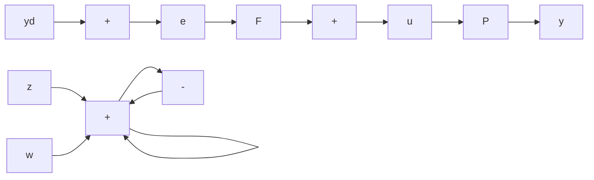

# ■ Theorem 4.4

The system of Figure 4.16 is internally stable if, and only if, $T(s)$ , $P^{-1}(s)T(s)$ , and $P(s)S(s)$ are stable.

Proof: From Figure 4.18,

$$
\begin{array}{l} z (s) = F (y _ {d} - y) \\ = F y _ {d} - F P (z + w) \\ \end{array}
$$

flowchart

Figure 4.18 The l-DOF system with additional input and output

and

$$z (s) = \frac {F}{1 + F P} y _ {d} - \frac {F P}{1 + F P} w. \tag {4.39}$$

Furthermore,

$$
\begin{array}{l} y (s) = P (z + w) \\ = P \left(\frac {F}{1 + F P} y _ {d} - \frac {F P}{1 + F P} w + w\right) \\ = \frac {F P}{1 + F P} y _ {d} + \frac {P}{1 + F P} w. \tag {4.40} \\ \end{array}
$$

Using the definitions of $T$ and $S$ , Equations 4.39 and 4.40 are rewritten as

$$
\left[ \begin{array}{l} z \\ y \end{array} \right] = \left[ \begin{array}{c c} P ^ {- 1} T & - T \\ T & P S \end{array} \right] \left[ \begin{array}{l} y _ {d} \\ w \end{array} \right]. \tag {4.41}
$$

Since stability of all elements of the matrix transfer function is necessary and sufficient for input-output stability, it follows that the system is input-output stable if, and only if, $T$ , $P^{-1}T$ , and $PS$ are stable transfer functions. Since input-output and internal stability are equivalent for controllable and observable realizations, the system of Figure 4.18 is internally stable. Finally, since the systems of Figures 4.16 and 4.18 differ only in the matter of inputs and outputs, the system of Figure 4.16 is also stable.
