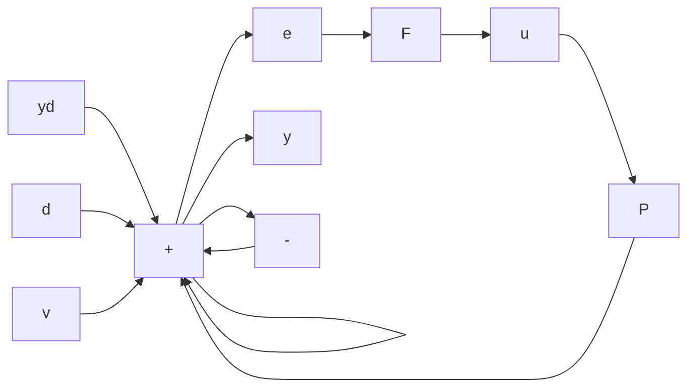

# 4.4.3 Performance Limitations: Sensors and Actuators

Limitations on performance originate from actuators, sensors, stability conditions, and robustness requirements. The first two are addressed in this section.

Figure 4.20 restores the measurement noise input, $v(t)$ . Equations 4.26 and 4.27 are still valid, but the effect of v is to be added. From Figure 4.20, with $y_{d} = d = 0$ ,

$$y (s) = - F P (y + v)y (s) = - \frac {F P}{1 + F P} v (s) = - T (s) v (s)$$

and

$$e (s) = y _ {d} - y (s) = T (s) v (s).$$

flowchart

Figure 4.20 The 1-DOF system with observation noise

Therefore, with all inputs, $y_{d}, d$ , and $v$ , we use superposition to modify Equations 4.35 and 4.36:

$$y (s) = T (s) y _ {d} (s) + S (s) d (s) - T (s) v (s) \tag {4.46}e (s) = S (s) y _ {d} (s) - S (s) d (s) + T (s) v (s). \tag {4.47}$$

With reference to Equation 4.7, the transfer functions describing the 1-DOF system are

$$H _ {d} = T, \quad H _ {w d} = S, \quad H _ {v} = - T.$$

In the absence of sensor noise, it is possible to simultaneously pursue two objectives: making the set-point transmission close to 1 and the disturbance transmission close to 0. That is achieved by making $|S|$ small; hence, $T = 1 - S \approx 1$ .

In the presence of sensor noise, making $T(s)$ close to 1 also has the effect of transmitting the sensor noise directly to the output and the error. In hindsight, this is not surprising. After all, the control system strives to reduce the difference between the desired output $y_{d}$ and the measured output $y_{m}$ . If $y_{m} = y + \Delta$ , then $y_{d} - y_{m} = y_{d} - y - \Delta$ ; even if the control system succeeds in making $y_{d} - y_{m} = 0$ , that still means y differs from $y_{d}$ by the measurement error $\Delta$ . In short, the control system is only as good as the information it receives from sensors.
