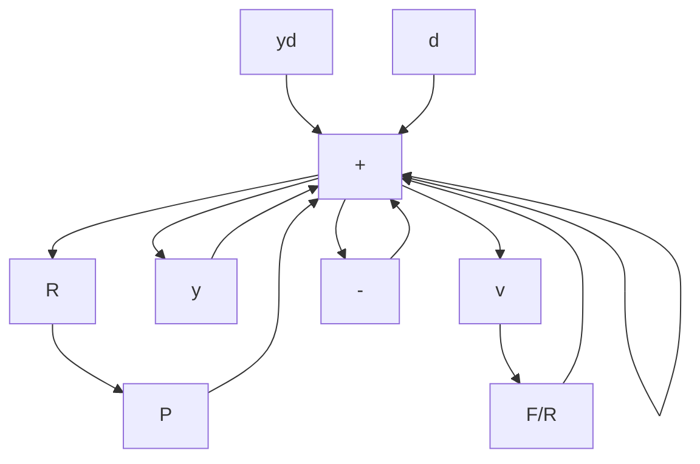

# 4.6 CLOSED-LOOP CONTROL, TWO DEGREES OF FREEDOM

In the 1-DOF configuration, $H_{d} = T$ and $H_{wd} = S = 1 - T$ . If the design is focused on shaping $H_{wd}$ to provide attenuation for a given disturbance spectrum, then $H_{d} = T = 1 - H_{wd}$ falls out as a by-product. There are cases in which it is desirable to choose $H_{d}$ and $H_{wd}$ independently; for example, the disturbance and set-point signals may have very different spectra. The two-degrees-of-freedom (2-DOF) configuration provides an extra degree of flexibility to make that possible. Figure 4.26 shows two independently adjustable controllers, one in the forward path and one in the feedback path. There are two transfer functions, $F(s)$ and $R(s)$ , to be used as design parameters. The configuration of Figure 4.26 is only one of several 2-DOF possibilities. (See Problems 4.35 and 4.36.)

flowchart

Figure 4.26 A 2-DOF feedback system

From the figure,

$$
\begin{array}{l} y = d + P R \left[ y _ {d} - \frac {F}{R} (y + v) \right] \\ y = \frac {P R}{1 + F P} y _ {d} + \frac {1}{1 + F P} d - \frac {F P}{1 + F P} v \\ \end{array}
$$

or

$$y = R P S y _ {d} + S d - T v \tag {4.65}$$

and

$$e = y _ {d} - ye = (1 - R P S) y _ {d} - S d + T v. \tag {4.66}$$

From Equations 4.65 and 4.66, for the 2-DOF configuration,k

$$H _ {d} = R P S, \quad H _ {w d} = S, \quad H _ {v} = - T.$$

The transmissions $H_{wd}$ and $H_{v}$ , from d and v, respectively, to y, are exactly the same as in the case of the 1-DOF design. The transmissions from $y_{d}$ to y and e are different; $H_{d} = RPS$ is independently adjustable by the additional parameter R. It is easy to show that the sensitivity of the transmission $H_{d}$ to changes in P is S, as in the 1-DOF case.

This suggests the following procedure. First, do a 1-DOF design for purposes of disturbance reduction and sensitivity. Then choose R to adjust the response to set point.

Stability is studied from Figure 4.27, with test inputs and outputs. The proof of controllability and observability is left to the reader under the assumption that P, R, and F/R are realized minimally.

From the figure,
