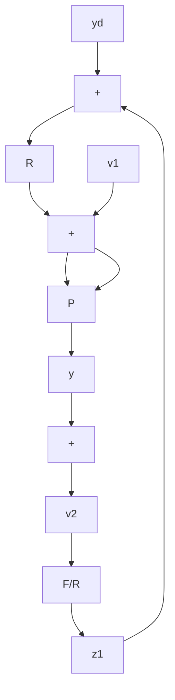

$$
\begin{array}{l} y = P \left\{v _ {1} + R \left[ y _ {d} - \frac {F}{R} (y + v _ {2}) \right] \right\} \\ = P v _ {1} + P R y _ {d} - P F (y + v _ {2}) \tag {4.67} \\ \end{array}
y = \frac {P R}{1 + F P} y _ {d} + \frac {P}{1 + F P} v _ {1} - \frac {F P}{1 + F P} v _ {2}
$$

or

$$y = R P S y _ {d} + P S v _ {1} - T v _ {2}. \tag {4.68}$$

flowchart

Figure 4.27 A 2-DOF feedback system with additional inputs and outputs

Also,

$$
\begin{array}{l} z _ {1} = \frac {F}{R} (y + v _ {2}) \tag {4.69} \\ = \frac {F P}{1 + F P} y _ {d} + \frac {F P}{R (1 + F P)} v _ {1} + \frac {F}{R (1 + F P)} v _ {2} \\ \end{array}
$$

or

$$z _ {1} = T y _ {d} + R ^ {- 1} T v _ {1} + R ^ {- 1} P ^ {- 1} T v _ {2}. \tag {4.70}$$

Finally,

$$z _ {2} = P ^ {- 1} y - v _ {1}z _ {2} = R S y _ {d} - T v _ {1} - P ^ {- 1} T v _ {2}. \tag {4.71}$$
