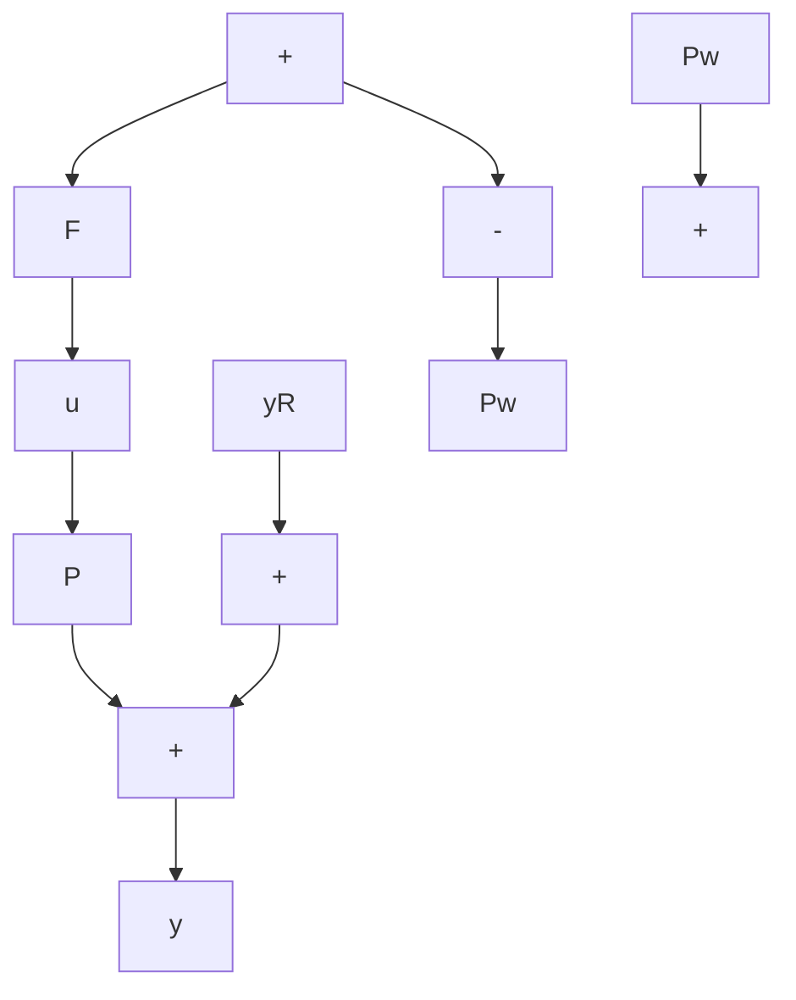

# Problems

M

4.1 Compute the unit step response of $y/y_{d}=H_{d}(s)=(.2s+1)/(s+1)^{3}$ . From the graph of the response, obtain the steady-state error, $e_{ss}$ ; the delay time, $T_{d}$ ; the rise time, $T_{r}$ ; the peak overshoot (if any); and the settling time, $T_{s}$ .

M

4.2 Repeat Problem 4.1 for $H_{d}(s) = [.9(.2s + 1)] / (s^{2} + .7s + 1)$ .

M

4.3 Repeat Problem 4.2 for $H_{d}(s) = [9(.2s + 1)] / [(s^{2} + .7s + 1)(s^{2} + s + 9)].$

4.4 Show that the magnitude of the kth-order Butterworth low-pass filter is

$$\left| B _ {k} (j \omega) \right| = \frac {1}{\left[ 1 + \left(\frac {\omega}{\omega_ {0}}\right) ^ {2 k} \right] ^ {1 / 2}}.$$

4.5 Show that the Butterworth high-pass filter $1 - B_k(s)$ has the same denominator as $B_k(s)$ , and that its numerator is that of $B_k(s)$ , minus the constant term.

4.6 You are given the following plants:

a. $P(s) = \frac{s + 3}{(s + 1)(s + 2)}$

b. $P(s) = \frac{-s + 3}{(s + 2)(s + 2)}$

c. $P(s) = \frac{1}{s(s + 1)}$

d. $P(s) = \frac{2}{(-s + 1)(s + 2)}$

For each plant, design (if possible) an open-loop compensator $F(s)$ such that $H_{d}(s)=4/(s^{2}+2s+4)$ and the system is internally stable. If that is impossible, explain why.

4.7 To further explore the significance of RHP zeros, let $H_{d}(s) = (-Ts + 1) / (Ts + 1)$ . Calculate $W(s) = 1 - H_{d}(s)$ , and sketch the magnitude Bode plot of $W(j\omega)$ , showing relevant features as functions of $T$ . How does the location of the RHP zero affect the low-frequency behavior of $W(j\omega)$ ?

4.8 Active suspension For the suspension system of Example 2.2 (Chapter 2), the transfer functions $P(s)$ (plant) and $P_w(s)$ (disturbance) are given by Equations 3.23 and 3.24 (Chapter 3), respectively. Suppose the roadway deviation $y_R$ can be measured and is to be used as a feedforward input, as in Figure 4.28.

flowchart

Figure 4.28 Feedforward design for the active suspension

a. Show that $y / y_R = P_w(s)[1 - F(s)P(s)]$ .

b. Design the compensator $F(s)$ so that
