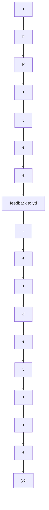

a. Show that $y / y_{R} = P_{w}(s)S(s) = P_{w}(s)[1 - T(s)]$ .   
b. Choose $T(s) = [k(s^2 + 85.861)] / (s^2 + 1.4\omega_0 s + \omega_0^2)$ . Choose $k$ such that $T(0) = 1$ . Calculate the required compensator $F(s)$ .   
c. Obtain the magnitude plots of $y / y_R$ for $\omega_0 = 4, 10$ , and 50 rad/s.   
d. Calculate $u/y_{R}$ for the values of $\omega_{0}$ in part (c), and obtain magnitude Bode plots.

M

4.14 For the plant $P(s) = [2(s + 1)] / [(s + 3)(-s + 6)]$ , design a stable 1-DOF system with $T(s) = (b_1 s + b_0) / (s + a)^2$ , for $a = 0.1, 1$ , and 10. As an additional requirement, $T(0) = 1$ . For each value of $a$ , plot $|T(j\omega)|$ and $|S(j\omega)|$ .

M

4.15 Repeat Problem 4.14 for $P(s) = [2(-s + 1)] / [(s + 3)(s + 6)]$ , with $S = (s^2 + b_1 s + b_0) / (s + a)^2$ .

4.16 For $P(s) = [2(-s + 1)] / [(s + 3)(-s + 6)]$ and $T(s) = [k(-s + b)] / (s^2 + a_1s + a_0)$ , calculate $b$ and $k$ (possibly as functions of $a_0$ and $a_1$ ) to ensure internal stability. What is the lower bound on the magnitude $|S(0)|$ ?

4.17 We wish to modify the control of Problem 4.16 to ensure that $T(\mathbf{O}) = 1$ , in addition to ensuring stability. A $T$ of order 3 is proposed.

a. Show that this cannot be done if $T$ has either no zeros or one zero.   
b. With $T(s) = [k(s + b_1)(s + b_2)] / (s + a)^3$ , determine $k_1, b_1$ , and $b_2$ as functions of $a$ . Plot $|T(j\omega)|$ for $a = .1, 1$ , and 10.

4.18 For stable plants, there are many similarities between a 1-DOF design and an open-loop/feedforward design, as Problems 4.8 and 4.13 readily show. Figure 4.29 shows a design with both open-loop and feedforward control, and with a noise signal v added to account for errors in the measurement of the disturbance.

flowchart

Figure 4.29 Open-loop and feedforward control
