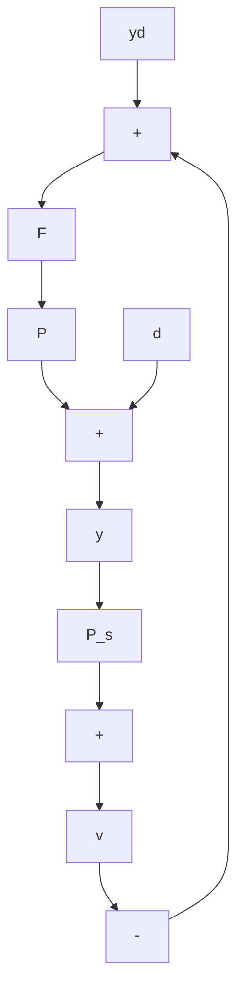

a. Calculate $y(s)$ and $e(s)$ in terms of the three inputs $y_{d}, d$ , and $v$ . Use $H_{d}(s) = F(s)P(s)$ .   
b. Compare with Equations 4.46 and 4.47 for a 1-DOF feedback system. Show that the two sets of equations are identical if $H_{d}(s) = T(s)$ .   
c. Write $u(s)$ in terms of the three inputs, and show that with $H_{d}(s) = T(s)$ , the expression is identical to Equation 4.48 for the 1-DOF case.   
d. If $P(s)$ has an RHP zero at $s = z_0$ , what conditions must be satisfied by $H_d(s)$ and $T(s)$ ?   
e. Compare the two schemes from the following points of view: response to set-point inputs, response to disturbances, and sensitivity to plant variations.

4.19 There are cases in which sensor dynamics may not be neglected.

a. In Figure 4.30, calculate the transfer functions $y / y_{d}, y / d$ , and $y / v$ . Discuss the effect of a low-pass $P_{s}(s)$ on performance.   
b. It is proposed that the dynamics of $P_{s}(s)$ be "undone" by cascading the measurement with $P_{s}^{-1}(s)$ , inserted at point $x$ in Figure 4.30. Suppose a stable 1-DOF design has been achieved under the assumption that $P_{s}(s) = 1$ . If $P_{s}(s)$ is stable, what condition(s) must $P_{s}(s)$ satisfy for the closed-loop system to remain stable? Calculate the same transfer functions as in part (a), and discuss the effect on setpoint tracking performance.

flowchart

Figure 4.30 System with sensor dynamics

4.20 The open-loop problem is also amenable to treatment by $H^{\infty}$ theory. Let

$$S ^ {\prime} (s) = 1 - F (s) P (s).$$

a. Show that, for internal stability, it is necessary that $S'(z_0)$ equal 1 at the zeros of $P$ in the closed RHP and that $S'$ be stable.

b. For the $P(s)$ of Problem 4.6, parts (a) and (b), calculate that $S'$ minimizes

$$\sup _ {\omega} | S ^ {\prime} (j \omega) | | W (j \omega) |$$

where $W(s) = (0.1s + 1) / (s + 1)$ .

4.21 Active suspension Let us use $H^{\infty}$ theory to redesign the feedforward system of Problem 4.8. Let the weight function be $W(s) = 0.1(s + 10\omega_0)^2 / (s^2 + 1.4\omega_0 s + \omega_0^2)$ .

a. Choose $F(s)$ to minimize
