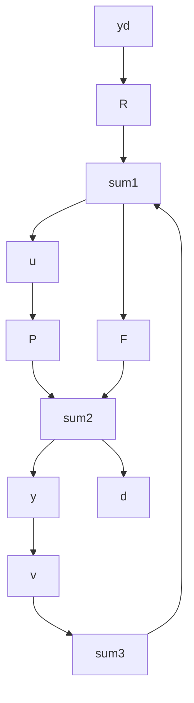
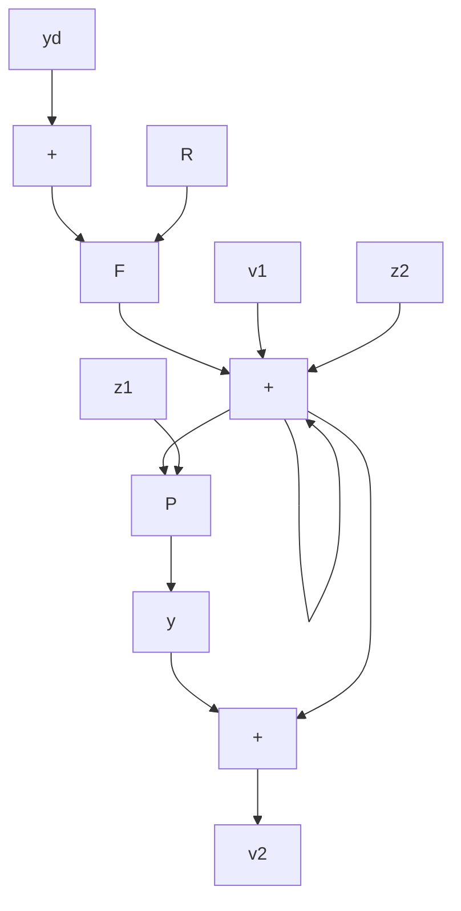

Figure 4.31 An alternate 2-DOF structure

4.36 Figure 4.32 shows yet another 2-DOF structure.

a. Show that, if R, F, and P are minimally realized, the system is controllable from the inputs $y_{d}$ , $v_{1}$ , and $v_{2}$ , and observable from the outputs y, $z_{1}$ , and $z_{2}$ .   
b. Calculate as functions of $R, P, P^{-1}, T$ , and $S$ the elements of the $3 \times 3$ matrix transfer function with inputs and outputs as in part (b).   
c. Show that the system is internally stable if, and only if, T, S, PS, $P^{-1}T$ , and R are stable.

flowchart

Figure 4.32 An alternate 2-DOF structure
