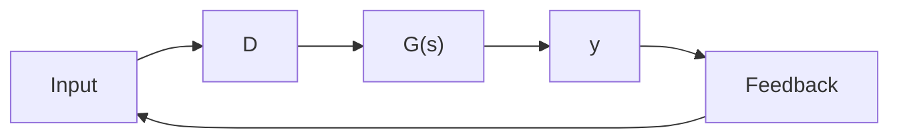

D the control gain in a single-input, single-output (SISO) feedback system. Note that D appears linearly in the A matrix, which is written as

$$
\left[ \begin{array}{c c c c} 0 & 0 & 1 & 0 \\ 0 & 0 & 0 & 1 \\ - 3 2. 6 6 7 & 3 2. 6 6 7 & 0 & 0 \\ 1 9 6 & - 7 9 6 & 0 & 0 \end{array} \right] + D \left[ \begin{array}{c c c c} 0 & 0 & 0 & 0 \\ 0 & 0 & 0 & 0 \\ 0 & 0 & \frac {- 1}{3 0 0} & \frac {1}{3 0 0} \\ 0 & 0 & \frac {1}{5 0} & \frac {- 1}{5 0} \end{array} \right].
$$

The second matrix, the one multiplying $D$ , is of rank 1. It can therefore be expressed as a column vector times a row vector, i.e., a dyad:

$$
\left[ \begin{array}{c c c c} 0 & 0 & 0 & 0 \\ 0 & 0 & 0 & 0 \\ 0 & 0 & \frac {- 1}{3 0 0} & \frac {1}{3 0 0} \\ 0 & 0 & \frac {1}{5 0} & \frac {- 1}{5 0} \end{array} \right] = \left[ \begin{array}{c} 0 \\ 0 \\ \frac {1}{3 0 0} \\ \frac {- 1}{5 0} \end{array} \right] \left[ \begin{array}{c c c c} 0 & 0 & - 1 & + 1 \end{array} \right].
$$

This is used to write the state equations as

$$
\frac {d}{d t} \left[ \begin{array}{l} x _ {1} \\ x _ {2} \\ v _ {1} \\ v _ {2} \end{array} \right] = \left[ \begin{array}{c c c c} 0 & 0 & 1 & 0 \\ 0 & 0 & 0 & 1 \\ - 3 2. 6 6 7 & 3 2. 6 6 7 & 0 & 0 \\ 1 9 6 & - 7 9 6 & 0 & 0 \end{array} \right] \left[ \begin{array}{l} x _ {1} \\ x _ {2} \\ v _ {1} \\ v _ {2} \end{array} \right] + \left[ \begin{array}{l} 0 \\ 0 \\ \frac {1}{3 0 0} \\ \frac {- 1}{5 0} \end{array} \right] (- D y)

y = \left[ \begin{array}{l l l l} 0 & 0 & 1 & - 1 \end{array} \right] \left[ \begin{array}{l} x _ {1} \\ x _ {2} \\ v _ {1} \\ v _ {2} \end{array} \right].
$$

Figure 5.7 illustrates this system. The transfer function $G(s)$ is that of a linear system, with the following matrices:

$$
A = \left[ \begin{array}{c c c c} 0 & 0 & 1 & 0 \\ 0 & 0 & 0 & 1 \\ - 3 2. 6 6 7 & 3 2. 6 6 7 & 0 & 0 \\ 1 9 6 & - 7 9 6 & 0 & 0 \end{array} \right]; \qquad B = \left[ \begin{array}{c} 0 \\ 0 \\ \frac {1}{3 0 0} \\ \frac {- 1}{5 0} \end{array} \right]; \qquad C = \left[ \begin{array}{c c c c} 0 & 0 & 1 & - 1 \end{array} \right].
$$

flowchart

Figure 5.7 Block diagram where the parameter D enters as a gain, active suspension

scatter

