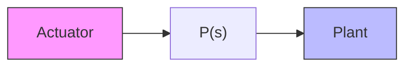

# Solution

$$[ 1 + \Delta (s) ] k P (s) = \frac {k}{(s / \omega_ {0}) ^ {2} + 2 \zeta (s / \omega_ {0}) + 1} P (s)$$

so that

$$\Delta (s) = \frac {- (s / \omega_ {0}) ^ {2} - 2 \zeta (s / \omega_ {0})}{(s / \omega_ {0}) ^ {2} + 2 \zeta (s / \omega_ {0}) + 1}.$$

Now,

$$\ell^ {2} (j \omega) = | \Delta (j \omega) | ^ {2} = \frac {(\omega / \omega_ {0}) ^ {4} + 4 \zeta^ {2} (\omega / \omega_ {0}) ^ {2}}{[ 1 - (\omega / \omega_ {0}) ^ {2} ] ^ {2} + 4 \zeta^ {2} (\omega / \omega_ {0}) ^ {2}}.$$

Clearly, $\ell (j\omega) = 1$ when

$$
\begin{array}{l} (\omega / \omega_ {0}) ^ {4} = [ 1 - (\omega / \omega_ {0}) ^ {2} ] ^ {2} \\ = 1 - 2 (\omega / \omega_ {0}) ^ {2} + (\omega / \omega_ {0}) ^ {4} \\ \end{array}
$$

or

$$\omega = \frac {1}{\sqrt {2}} \omega_ {0}.$$

The reader is invited to show that $\ell(j\omega) > 1$ for $\omega > \frac{1}{\sqrt{2}}\omega_0$ .

Therefore, if the model simplification is used, we cannot guarantee stability if the bandwidth much exceeds $\omega_{0}/\sqrt{2}$ . (This condition is conservative, of course, because Theorem 5.2 “throws away” phase information.)

flowchart

Figure 5.32 Actuator with dynamics and plant
