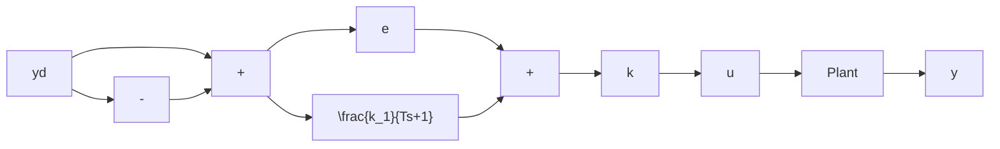

Figure 6.18 The lag compensator

To ensure that $G_{c}(j\omega_{c}) \approx 1$ , we refer to Equation 6.27 and impose

$$\left| \frac {k _ {1}}{j \omega_ {c} T + 1} \right| = \frac {k _ {1}}{\sqrt {\omega_ {c} ^ {2} T ^ {2} + 1}} = a \ll 1$$

or, solving for $\omega_{c}T$ ,

$$\omega_ {c} T = \sqrt {\frac {k _ {1} ^ {2}}{a ^ {2}} - 1} \tag {6.30}$$

where $a$ is such that $k_{1} / a > 1$ .

To summarize the procedure for lag compensation:

(i) Carry out a pure-gain design, observing the specified stability indicators. Identify $\omega_{c}$ , the crossover frequency.   
(ii) Calculate the compensator dc gain required to meet the dc steady-state specifications. If the gain of step (i) exceeds this, stop; if not, go on.   
(iii) Calculate $k_{1}$ so that the gain of step (i) multiplied by $(1 + k_{1})$ equals the required compensator dc gain.   
(iv) With $a \sim 0.1$ or less, compute the time constant $T$ from Equation 6.30.   
(v) Form the complete compensator by solving Equation 6.28 for $G_{c}(s)$ and multiplying by the gain of step (i).
