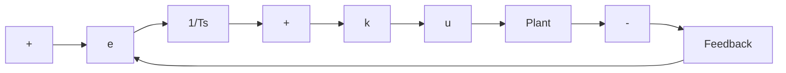

# Proportional-Integral Control

Proportional-integral (PI) control is essentially a limiting case of the lag compensation. It is obtained by letting $T$ go to infinity while keeping the ratio $k_{1} / T$ finite.

flowchart

Figure 6.22 Proportional-integral (PI) control

As shown in Figure 6.22, the PI controller has the transfer function

$$
\begin{array}{l} G _ {c} (s) = k \left(1 + \frac {1}{T s}\right) \\ = k \frac {T s + 1}{T s}. \tag {6.34} \\ \end{array}
$$

In this equation, k is the gain that achieves the desired degree of stability in the pure-gain design. The integration increases the type number of the system by one—from Type 0 to Type 1, from Type 1 to Type 2, and so on. The design approach is similar to that used with lag compensation except that there is no counterpart of the gain $k_{1}$ , because integration provides infinite gain at dc. The time constant T is chosen to make $G_{c} \approx k$ in the neighborhood of the crossover frequency $\omega_{c}$ . That will be true if

$$\frac {1}{\omega_ {c} T} = a \ll 1. \tag {6.35}$$
