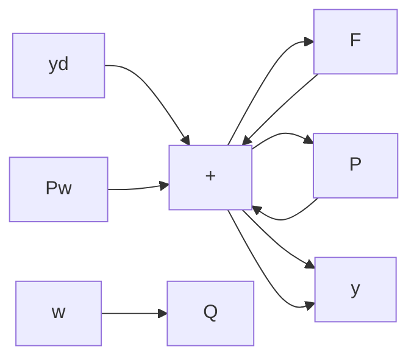

# 6.4 FEEDFORWARD CONTROL

When feedforward is used, it is normally in addition to feedback, as in Figure 6.28. The transfer function from disturbance to output is

$$\frac {y}{w} = P _ {w} S - Q P S = (P _ {w} - Q P) S. \tag {6.45}$$

The feedforward design problem is to choose a stable Q such that $(P_{w}-QP)S$ is close to zero. Since $|S(j\omega)|$ is usually small at low frequency, the designer can focus on a frequency range where $|S(j\omega)|$ becomes appreciable; that will take place near crossover. In other words, feedback is used to handle the low frequencies, and feedforward to extend the bandwidth beyond the crossover frequency. It is understood that the transfer functions $P_{w}$ and P must be relatively accurate in the frequency range where feedforward is to act.

flowchart

Figure 6.28 Feedforward compensation

We want $Q(j\omega) \sim [P_w(j\omega)] / [P(j\omega)]$ in a frequency region near crossover. It is often sufficient to approximate this with a simple lead or lag [6], or in some cases with a constant.
