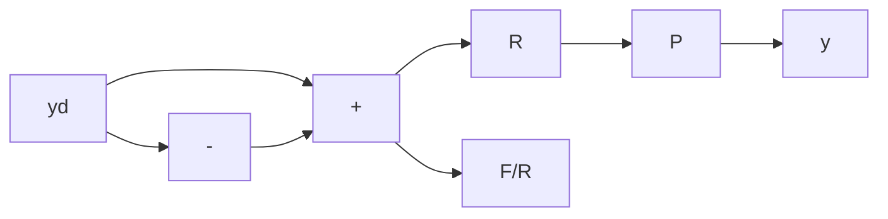

# 6.5 2-DOF CONTROL

The two-degrees-of-freedom (2-DOF) configuration of Chapter 4 is repeated in Figure 6.30. In Chapter 4, the transfer function from set point to output was calculated to be

$$\frac {y}{y _ {d}} = R P S. \tag {6.46}$$

Recall that $R$ may have RHP poles to cancel any RHP zeros of $PS$ except those that are also RHP zeros of $P$ .

Since $F = T / SP$ , we write Equation 6.46 as

$$\frac {y}{y _ {d}} = \frac {R}{F} T. \tag {6.47}$$

line

| Frequency (rad/s) | Feedback only | Feedback plus feedforward |
| --- | --- | --- |
| 0.1 | 5 | -40 |
| 1 | 10 | -20 |
| 10 | -20 | -30 |
| 100 | -60 | -60 |

Figure 6.29 Disturbance frequency response with and without feedforward, dc servo

flowchart

Figure 6.30 A 2-DOF feedback system

We choose $R(s) = F(s)R'(s)$ , so that

$$\frac {y}{y _ {d}} = R ^ {\prime} (s) T (s). \tag {6.48}$$

Assuming that there are no unstable pole-zero cancellations between $F$ and $P$ , the unstable poles of $F$ are zeros of $S$ and are thus allowable. It will suffice to make $R'$ stable to satisfy the conditions for internal stability.

There are two cases of interest, depending on whether the bandwidth of the response to $y_{d}$ is to be less or greater than that of $T(j\omega)$ :

Case 1: Decreased bandwidth. We may wish to do this to avoid saturating the actuators in response to sudden changes in the set point, or perhaps to meet a requirement for a smooth, overdamped response. Since $T(j\omega) \sim 1$ in the frequency band under consideration, $R'(s)$ may be any low-pass function.

Case 2: Increased bandwidth. Here, we wish to have $R'T \sim 1$ over a wider range of frequencies than the bandwidth of T. Since $T \sim 1$ up to about crossover, we must choose $R'(s)$ to be approximately the inverse of $T$ near crossover and beyond. If the frequency range is extended only moderately, $T^{-1}$ may be approximated by a simple transfer function.

An instance of Case 1 often found in practice is the modification of a PID design to lower the bandwidth of the set-point response. The PID controller is
