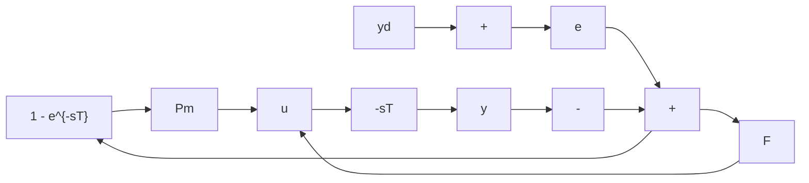

# Solution

With the approximation, we obtain the closed-loop characteristic equation from

$$1 + k \frac {(- T / 2) s + 1}{(T / 2) s + 1} \cdot \frac {1}{\tau s + 1} = 0\frac {1}{2} \tau T s ^ {2} + \left(\frac {1}{2} T + \tau - \frac {1}{2} k T\right) s + k = 0.$$

Assuming $\tau$ , $T > 0$ , it follows easily that, for stability,

$$\frac {1}{2} T + \tau - \frac {1}{2} k T > 0, \qquad k > 0$$

or

$$0 < k < 1 + 2 \frac {\tau}{T}.$$

The correspondence with the results of Example 6.16 is rather coarse. Even for $\tau / T = 0.1$ , the upper limit is $15\%$ higher than the true value.

The standard control structures may be applied to systems with delay, of course, but a controller structure exists that is especially adapted to such systems. The Smith predictor [7] uses the structure shown in Figure 6.37, where the transfer function $P_{m}(s)$ is a model of $P(s)$ , the plant, with the delay removed. The controller, which is the portion in the dotted line, requires a delay line for implementation. In a digital control system, that is accomplished by storing past values of the signal to be delayed.

The controller transfer function is

$$\frac {u}{e} = \frac {F}{1 + P _ {m} F (1 - e ^ {- s T})}$$

and the overall transmission is

$$
\begin{array}{l} \frac {y}{y _ {d}} = \frac {\frac {F P e ^ {- s T}}{1 + P _ {m} F (1 - e ^ {- s T})}}{1 + \frac {F P e ^ {- s T}}{1 + P _ {m} F (1 - e ^ {- s T})}} \\ = \frac {F P e ^ {- s T}}{1 + F P _ {m} - F P _ {m} e ^ {- s T} + F P e ^ {- s T}}. \\ \end{array}
$$

If $P_{m} = P$ , then

$$\frac {y}{y _ {d}} = \frac {F P}{1 + F P} e ^ {- s T}. \tag {6.54}$$

The transfer function $FP/(1 + FP)$ is the closed-loop transmission obtained by using the controller F with the plant, with the delay removed. That suggests the following design procedure for a Smith predictor: design a compensator $F(s)$ for the plant without the delay, and use F in the controller of Figure 6.37. The resulting dynamic behavior is simply that of the control loop designed without the delay, except that all responses are delayed by T.

flowchart

Figure 6.37 The Smith predictor
