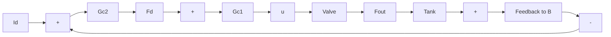

If the flow-loop dynamics are much faster than the dynamics of the level process, then: (i) flow loop transients can be considered to take place at constant $\ell$ , and the inner loop is designed as an LTI system; (ii) transients in the error $F_{out} - F_{d}$ are so fast that they do not affect the level, and the outer loop is designed with $F_{d} (\approx F_{\mathrm{out}})$ as its input. In effect, the flow loop takes care of the valve nonlinearity, which does not need to be considered in the design of the outer loop.

a. Design the flow control loop with $G_{c1} = 1 / \tau s$ . Choose $\tau$ such that the 3-db bandwidth is at least 30 rad/s for all values of $\ell$ between 0.5 m and 1.5 m. (Use $c = 2.0\mathrm{m}^{3/2}/\mathrm{s}$ ).

b. Design the level control loop with $G_{c2} = k$ . Assume that $F_{\mathrm{out}} \approx F_d$ , i.e., the flow loop has a transmission of 1. (See Equation 2.28 for the model, with $A = 1 \, \mathrm{m}^2$ .) The 3-db bandwidth should be 1 rad/s.

c. Simulate the system (including the valve) and compute the responses, from equilibrium at $\ell_{d}=1$ m to step changes $\ell_{d}=1.2$ m, 1.5 m, 0.8 m, and 0.5 m.

flowchart

Figure 6.38 Cascaded control loops

6.21 It is often necessary to tune a controller experimentally, and several rule-of-thumb methods have been developed for that purpose. As an example, let us go through the following steps, assuming a stable plant:

a. Use pure-gain control and increase the gain to $k_0$ , where the step response is on the verge of instability. Argue from Root Locus or Nyquist ideas that the oscillation frequency $\omega_0$ is such that $\neq P(j\omega_0) = 180^\circ$ , and that the gain $k_0$ is such that $k_0|P(j\omega_0)| = 1$ .   
b. Use the information obtained in (a) to design a PI controller with a 6-db gain margin where the integral action has negligible effect at $\omega_0$ .   
c. Try this on the plant $P(s)$ of Problem 6.1, with $k = 1$ , using the model for simulation only (i.e., perform the "experiments" using the model). Compute the step response.
