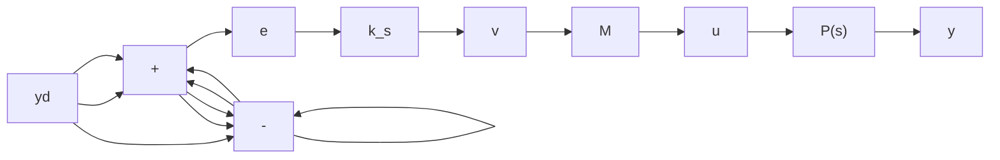

6.22 Industrial controllers are usually provided with various “fixes” to deal with the real, nonlinear world. One effect to be avoided is reset windup. Figure 6.39 shows a pure-integral controller feeding an actuator that is subject to saturation. If the actuator saturates, the input u cannot increase to help reduce the error as rapidly as we would wish. The error is integrated, and the variable v grows still more. When the error finally changes sign, some time must pass before the integrator is “discharged” and its output falls within the linear range.

a. With $K = 4, M = 1$ , and $P(s) = 1 / (s + 1)$ , simulate the system for a unit step in $y_d$ . Show $y(t), v(t), e(t)$ , and $u(t)$ .   
b. Repeat part (a) without the saturation.

c. One "fix" is to introduce some logic and clamp $v$ at $\pm M$ , as follows:

$$\text { If } v (t) = M \text { and } e (t) > 0, \text { then } v (t) \text { is fixed at } M.\text { If } v (t) = - M \text { and } e (t) < 0, \text { then } v (t) \text { is fixed at } - M.$$

Otherwise, v is K times the integral of e.

Repeat part (a) with this modification.

flowchart

Figure 6.39 Model used to study reset windup

6.23 a. Design a lead compensator for the system of Problem 6.1, for a phase margin of $50^{\circ}$ and a crossover frequency of 0.9 rad/s.

b. To show the effect of an increased bandwidth on the control amplitude, calculate the plant input in response to a unit-step set point, for the pure-gain design of Problem 6.1 and for the design of part (a).

c. Add lag compensation to the design of part (a) so as to obtain a steady-state error of 0.15 to a unit step. Compute the step response.

6.24 a. Design a lead compensator for the system of Problem 6.2. Keep the same phase margin, but increase the crossover frequency to 1.5 rad/s.

b. Calculate the error and plant input response to a unit ramp, for the pure-gain design of Problem 6.2 and for the design of part (a).

c. Add lag compensation to the design of part (a) so as to obtain a steady-state error of 0.1 to a unit ramp. Compute the error response to a unit ramp in this case.
