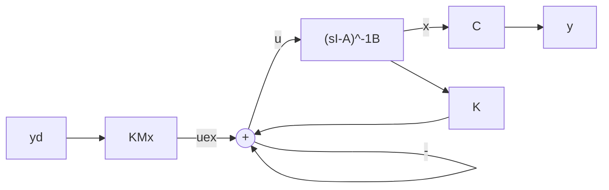

Figure 7.2 State feedback in terms of full signals (incremental plus steady state)

With $\Delta \mathbf{x} = \mathbf{x} - \mathbf{x}^*$ , $\Delta \mathbf{y} = \mathbf{y} - \mathbf{y}_d$ , and $\Delta \mathbf{u} = \mathbf{u} - \mathbf{u}^*$ , it was established in Chapter 2 that

$$\Delta \dot {\mathbf {x}} = A \Delta \mathbf {x} + B \Delta \mathbf {u}\Delta \mathbf {y} = C \Delta \mathbf {x}. \tag {7.6}$$

The state feedback law $\Delta \mathbf{u} = -K\Delta \mathbf{x}$ , with $K$ appropriately selected, will drive $\Delta \mathbf{x}$ and $\Delta \mathbf{y}$ to zero, thus achieving the regulation objective. Since $\mathbf{u} = \mathbf{u}^{*} + \Delta \mathbf{u}$ , the control system is as shown in Figure 7.1. Figure 7.2 follows from expanding $\mathbf{u}$ as follows:

$$
\begin{array}{l} \mathbf {u} = \mathbf {u} ^ {*} + \Delta \mathbf {u} = \mathbf {u} ^ {*} - K \Delta \mathbf {x} \\ = \mathbf {u} ^ {*} - K (\mathbf {x} - \mathbf {x} ^ {*}) \\ = (M _ {u} + K M _ {x}) \mathbf {y} _ {d} - K \mathbf {x} \\ = \mathbf {u} _ {e x} - K \mathbf {x} \tag {7.7} \\ \end{array}
$$

where $\mathbf{u}_{ex} = (M_u + KM_x)\mathbf{y}_d$ . The response for a given initial state $\mathbf{x}(0)$ is calculated by solving

$$\Delta \dot {\mathbf {x}} = (A - B K) \Delta \mathbf {x} \tag {7.8}$$

for $\Delta \mathbf{x}(0) = \mathbf{x}(0) - \mathbf{x}^*$ . The state, control, and output are then obtained as

$$\mathbf {x} (t) = \mathbf {x} ^ {*} + \Delta \mathbf {x} (t)\mathbf {u} (t) = \mathbf {u} ^ {*} + \Delta \mathbf {u} (t)\mathbf {y} (t) = \mathbf {y} _ {d} + C \Delta \mathbf {x} (t). \tag {7.9}$$

As we shall establish in the next section, the gain K may, under certain conditions, be selected to place the closed-loop eigenvalues at selected locations in complex plane. For the moment, we present a simple example to show the pole-shifting property.

Example 7.1 Let $A = \begin{bmatrix} 0 & 1 \\ 0 & 0 \end{bmatrix}$ and $B = \begin{bmatrix} -1 \\ 1 \end{bmatrix}$ . Calculate the closed-loop eigenvalues for the state feedback gain $K = [k_1 - k_2]$ .

Solution We have
