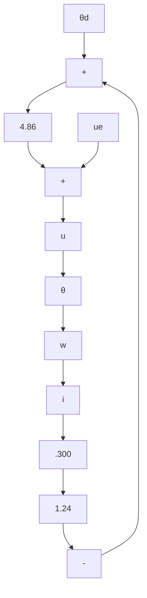

$$
\left[ \begin{array}{c} 0 \\ 0 \\ 0 \end{array} \right] = \left[ \begin{array}{c c c} 0 & 1 & 0 \\ 0 & 0 & 4. 4 3 8 \\ 0 & - 1 2 & - 2 4 \end{array} \right] \left[ \begin{array}{c} \theta^ {*} \\ \omega^ {*} \\ i ^ {*} \end{array} \right] + \left[ \begin{array}{c} 0 \\ 0 \\ 2 0 \end{array} \right] v ^ {*}
\theta_ {d} = \theta^ {*}.
$$

The result is $\theta^{*} = \theta_{d}$ , $\omega^{*} = i^{*} = v^{*} = 0$ . The control law, illustrated in Figure 7.3, is

$$
\begin{array}{l} v = v ^ {*} - K \Delta \mathbf {x} \\ = 0 - \left[ \begin{array}{l l l} k _ {1} & k _ {2} & k _ {3} \end{array} \right] \left(\left[ \begin{array}{c} \theta \\ \omega \\ i \end{array} \right] - \left[ \begin{array}{c} \theta_ {d} \\ 0 \\ 0 \end{array} \right]\right) \\ \end{array}
v = - 4. 8 6 (\theta - \theta_ {d}) - 1. 2 4 \omega - 0. 3 0 0 i.
$$

flowchart

Figure 7.3 State feedback for pole placement, dc servo

To write the closed-loop transfer function, we observe that the plant has zeros. By Theorem 7.1, the closed-loop transfer function has no zeros, so

$$
\begin{array}{l} \frac {\theta}{\theta_ {d}} = \frac {k}{(s + 2 4) (s + 3 + 3 j) (s + 3 - 3 j)} \\ = \frac {k}{(s + 2 4) (s ^ {2} + 6 s + 1 8)}. \\ \end{array}
$$

Since $\theta \to \theta_d$ as $t \to \infty$ , the transfer function must go to 1 as $s \to 0$ ; hence $k = (24)(18) = 432$ and

$$\frac {\theta}{\theta_ {d}} = \frac {4 3 2}{(s + 2 4) (s ^ {2} + 6 s + 1 8)}.$$
