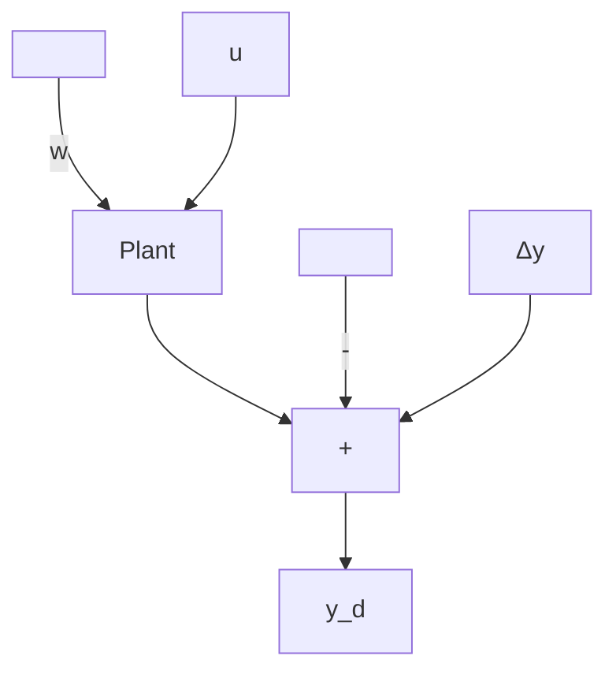

# 7.5.1 Feedforward Compensation

The foregoing sections have dealt with the basic problem of taking a system from a nonzero initial state to the zero state. We now consider modifications to the basic scheme, to handle disturbances and set-point changes.

To fix ideas, consider the model of Figure 7.12, described by the equations

$$\dot {\mathbf {x}} = A \mathbf {x} + B \mathbf {u} + \Gamma \mathbf {w} \tag {7.34}\Delta \mathbf {y} = C \mathbf {x} - \mathbf {y} _ {d}. \tag {7.35}$$

Here, w is a disturbance input and $y_{d}$ is the set-point, or reference, input.

Let us begin with the simple case $\mathbf{w} = \mathbf{w}^*$ and $\mathbf{y}_d = \mathbf{y}_d^*$ , where $\mathbf{w}^*$ and $\mathbf{y}_d^*$ are constant. The dc steady state (if it exists) defined by $\Delta \mathbf{y} = \mathbf{0}$ satisfies the algebraic linear equation

$$
\left[ \begin{array}{l l} A & B \\ C & 0 \end{array} \right] \left[ \begin{array}{l} \mathbf {x} ^ {*} \\ \mathbf {u} ^ {*} \end{array} \right] = \left[ \begin{array}{c} - \Gamma \mathbf {w} ^ {*} \\ \mathbf {y} _ {d} ^ {*} \end{array} \right] \tag {7.36}
$$

If a solution exists and is unique, linearity dictates that $\mathbf{x}^*$ and $\mathbf{u}^*$ are linear functions of $\mathbf{w}^*$ and $\mathbf{y}_d^*$ , i.e., of the form

$$\mathbf {u} ^ {*} = K _ {w} ^ {*} \mathbf {w} ^ {*} + K _ {y} ^ {*} \mathbf {y} _ {d} ^ {*} \tag {7.37}$$

where $K_{w}^{*}$ and $K_{y}^{*}$ are gain matrices.

Figure 7.13 shows that Equation 7.37 represents a feedforward system. An input $u^{*}$ is calculated that, in the dc steady state, will exactly cancel out the effect of the constant disturbance $w^{*}$ and make the output equal to the set point.

Another way to view this is provided by the transfer function expression of Equation 4.1 (Chapter 4):

$$\mathbf {y} (s) = P (s) \mathbf {u} (s) + P _ {w} (s) \mathbf {w} (s).$$

flowchart

Figure 7.12 Showing the reference and disturbance signals as zero-input outputs of LTI systems

flowchart

