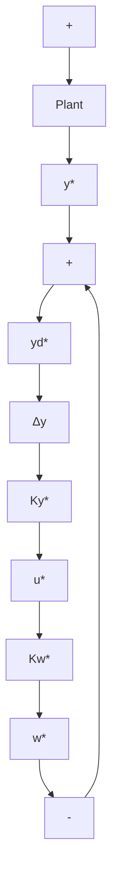

Figure 7.13 Control systems with feedforward from the steady-state and disturbance signals

If the dc steady state exists, it satisfies

$$\mathbf {y} ^ {*} = P (0) \mathbf {u} ^ {*} + P _ {w} (0) \mathbf {w} ^ {*}$$

and thus, for a system with equal numbers of inputs and outputs,

$$\mathbf {u} ^ {*} = P ^ {- 1} (0) [ \mathbf {y} _ {d} ^ {*} - P _ {w} (0) \mathbf {w} ^ {*} ]. \tag {7.38}$$

Equation 7.38 is clearly of the same form as Equation 7.37, and makes sense if $P^{-1}(0)$ exists. $P^{-1}(0)$ does exist if $\left[ \begin{array}{cc}A & B\\ C & 0 \end{array} \right]$ is nonsingular, since that is also the condition for having no transmission zero at $s = 0$ .

It is possible, by feedforward, to asymptotically track any reference input of the form $y_{d}^{*}e^{s^{*}t}$ and/or any disturbance of the same form. We need only replace $P(0)$ and $P_{w}(0)$ with $P(s^{*})$ and $P_{w}(s^{*})$ , and write $\mathbf{u}(t)=\mathbf{u}^{*}e^{s^{*}t}$ . In particular, it is possible in this manner to generate a sinusoidal input in order to track a sinusoid of the same frequency.

Regulation to a given dc steady state was covered earlier in this chapter; the addition of a constant disturbance affects only the calculation of the steady-state input. Asymptotic convergence to a more general exponential input is carried out in precisely the same way. Essentially, then, we have a two-step procedure:

1. Calculate the steady-state (or general exponential) input so that the reference output is asymptotically tracked.   
2. Using Equation 7.6, design a feedback law for $\Delta \mathbf{u}$ in terms of $\Delta \mathbf{x}$ .
