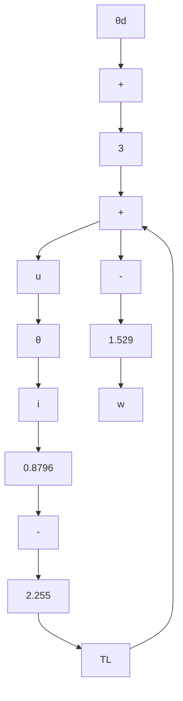

# Example 7.8 (dc Servo)

The dc servo of Example 2.1 (Chapter 2) is subjected to a step load torque $T_{L} = T_{LS} u_{-1}(t)$ .

(a) Calculate, as a function of $T_{LS}$ , the constant input $v_s$ required for a dc steady state $\theta = \theta_d$ .   
(b) Using the results of Example 7.6, obtain the control law that minimizes $J = \int_0^\infty [9(\theta -\theta_d)^2 +(v - v_s)^2 ]dt$ .

Solution From Equation 2.19, the dc steady state requires

$$\omega = 04. 4 3 8 i - 7. 3 9 6 T _ {L} = 0- 2 4 i + 2 0 v = 0.$$

With $T_{L} = T_{LS}$ , it follows that

$$i = i _ {s} = 1. 6 6 7 T _ {L S}v = v _ {s} = 1. 2 i s = 2. 0 T _ {L S}.$$

The dc steady-state input and states are

$$v _ {s} = 2. 0 T _ {L S}, \quad \theta = \theta_ {d}, \quad \omega = 0, \quad i = 1. 6 6 7 T _ {L S}.$$

To solve part (b), recall that the incremental system of Equation 7.6 is the same as in Example 7.6. Therefore, the problem of taking the state to the reference state has already been solved. Using the gain vector derived in Example 7.6,

$$v - v _ {s} = - 3. 0 (\theta_ {.} - \theta_ {d}) - 0. 8 7 9 6 \omega - 0. 1 5 2 9 (i - i _ {s}).$$

The complete control law, illustrated in Figure 7.14, is

$$v = 2. 0 T _ {L S} - 3. 0 (\theta - \theta_ {d}) - 0. 8 7 9 6 \omega - 0. 1 5 2 9 (i - 1. 6 6 7 T _ {L S})= 2. 2 5 5 T _ {L S} - 3. 0 (\theta - \theta_ {d}) - 0. 8 7 9 6 \omega - 0. 1 5 2 9 i.$$

Figure 7.15 shows the angle error response $\theta(t) - \theta_d$ to a load-torque step $T_L = 0.01u_{-1}(t)$ , starting from $\theta = \theta_d$ , $\omega = i = 0$ .

flowchart

Figure 7.14 Control system with feedforward, dc servo

line

| Time(s) | Angle (rad) |
| --- | --- |
| 0.0 | 0.0 |
| 0.2 | -3.8e-4 |
| 0.4 | -4.0e-4 |
| 0.6 | -2.5e-4 |
| 0.8 | -1.0e-4 |
| 1.0 | -0.5e-4 |
| 1.2 | -0.2e-4 |
| 1.4 | 0.0 |
| 1.6 | 0.1e-4 |
| 1.8 | 0.15e-4 |
| 2.0 | 0.15e-4 |
| 2.2 | 0.1e-4 |
| 2.4 | 0.05e-4 |
| 2.6 | 0.02e-4 |
| 2.8 | 0.01e-4 |
| 3.0 | 0.0 |

Figure 7.15 Angle error response to a step in load torque, dc servo
