\Delta \mathbf {y} = \left[ \begin{array}{l l l} C & 0 & - C _ {y} \end{array} \right] \left[ \begin{array}{l} \Delta \mathbf {x} \\ \mathbf {z} _ {w} \\ \mathbf {z} _ {y} \end{array} \right]. \tag {7.44}
$$

This system is clearly not controllable, as neither $z_{w}$ nor $z_{y}$ is affected by the control input $\Delta u$ . The state feedback law has the form

$$
\begin{array}{l} \Delta \mathbf {u} = - \left[ \begin{array}{l l l} K _ {x} & K _ {w} & K _ {y} \end{array} \right] \left[ \begin{array}{l} \Delta \mathbf {x} \\ \mathbf {z} _ {w} \\ \mathbf {z} _ {y} \end{array} \right] \\ = - K _ {x} \Delta \mathbf {x} - K _ {w} \mathbf {z} _ {w} - K _ {y} \mathbf {z} _ {y} \tag {7.45} \\ \end{array}
$$

As Figure 7.16 shows, this has both feedback and feedforward components. With this control law, the closed-loop state equations are

$$
\frac {d}{d t} \left[ \begin{array}{c} \Delta \mathbf {x} \\ \mathbf {z} _ {w} \\ \mathbf {z} _ {y} \end{array} \right] = \left[ \begin{array}{c c c} A - B K _ {x} & \Gamma C _ {w} - B K _ {w} & - B K _ {y} \\ 0 & A _ {w} & 0 \\ 0 & 0 & A _ {y} \end{array} \right] \left[ \begin{array}{c} \Delta \mathbf {x} \\ \mathbf {z} _ {w} \\ \mathbf {z} _ {y} \end{array} \right] \tag {7.46}
$$

flowchart

```mermaid
graph TD
    A["Kw"] --> B["Cw"]
    B --> C["Δw"]
    C --> D["Δx"]
    D --> E["C"]
    E --> F["+"]
    F --> G["Cy"]
    G --> H["zy"]
    H --> I["Block"]
    I --> J["Ky"]
    J --> K["Δy"]
    K --> L["Kx"]
    L --> M["Δu"]
    M --> N["+"]
    N --> O["Cw"]
    O --> P["zw"]
    P --> Q["Kw"]
    Q --> R["Δw"]
    R --> S["Block"]
    S --> T["Cw"]
    T --> U["zw"]
    U --> V["Block"]
    V --> W["Δy"]
    W --> X["Cy"]
    X --> Y["zy"]
    Y --> Z["Block"]
    Z --> AA["Ky"]
    AA --> AB["Δu"]
    AB --> AC["+"]
    AC --> AD["Cw"]
```

Figure 7.16 Control system with feedforward from the states of the reference and disturbance subsystems

From the block-triangular nature of the matrix, we infer that the eigenvalues are those of $A - BK_{x}$ , $A_{w}$ , and $A_{y}$ . As expected, the modes associated with the disturbance and the reference input are unchanged.
