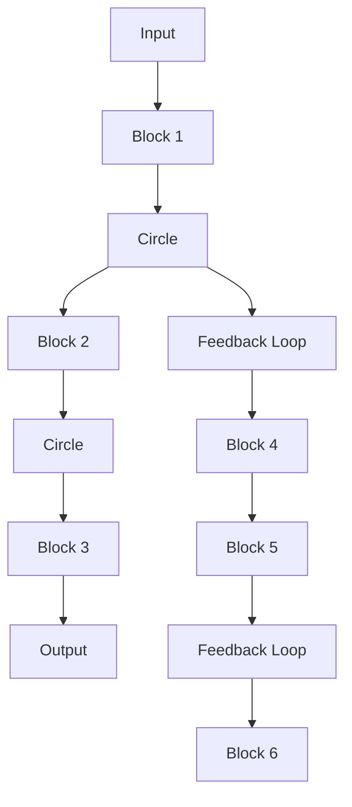

# COMPUTER- CONTROLLED SYSTEMS

THEORY AND DESIGN

flowchart

KARL J. ÅSTRÖM
BJÖRN WITTENMARK

COMPUTER-CONTROLLED SYSTEMS

Theory and Design

(Third Edition)

计算机控制系统 理论与设计

(第3版)

KARL J. ASTRÖM

BJÖRN WITTENMARK

natural_image

Blurred abstract image with no discernible text, symbols, or identifiable objects

