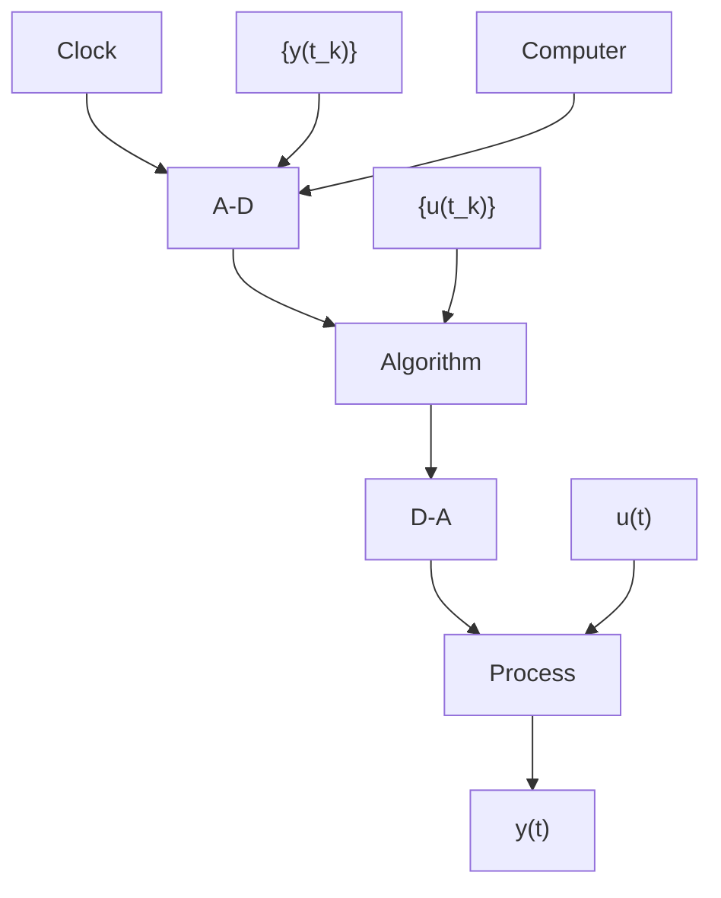

Figure 1.1 Schematic diagram of a computer-controlled system.

The mixture of different types of signals sometimes causes difficulties. In most cases it is, however, sufficient to describe the behavior of the system at the sampling instants. The signals are then of interest only at discrete times. Such systems will be called discrete-time systems. Discrete-time systems deal with sequences of numbers, so a natural way to represent these systems is to use difference equations.

The purpose of the book is to present the control theory that is relevant to the analysis and design of computer-controlled systems. This chapter provides some background. A brief overview of the development of computer-control technology is given in Sec. 1.2. The need for a suitable theory is discussed in Sec. 1.3. Examples are used to demonstrate that computer-controlled systems cannot be fully understood by the theory of linear time-invariant continuous-time systems. An example shows not only that computer-controlled systems can be designed using continuous-time theory and approximations, but also that substantial improvements can be obtained by other techniques that use the full potential of computer control. Section 1.4 gives some examples of inherently sampled systems. The development of the theory of sampled-data systems is outlined in Sec. 1.5.
