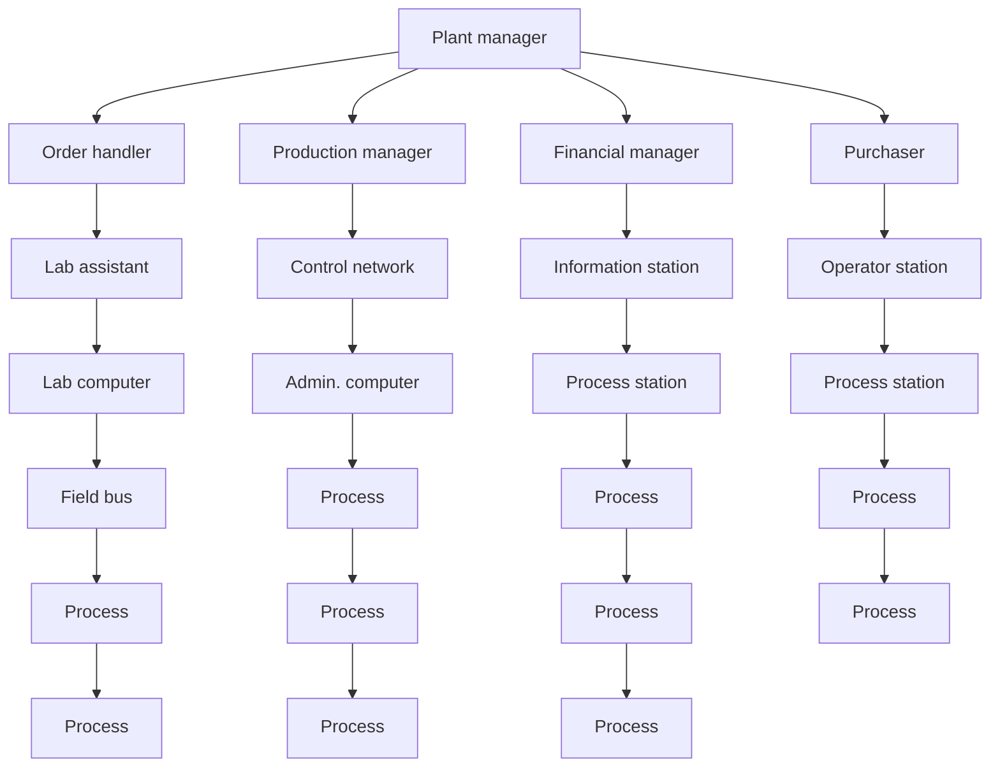

# Plantwide Supervision and Control

The next development phase in industrial process-control systems was facilitated by the emergence of common standards in computing, making it possible to integrate virtually all computers and computer systems in industrial plants into a monolithic whole to achieve real-time exchange of data across what used to be closed system borders. Such interaction enables

• top managers to investigate all aspects of operations   
- production managers to plan and schedule production on the basis of current information   
- order handlers and liaison officers to provide instant and current information to inquiring customers   
- process operators to look up the cost accounts and the quality records of the previous production run to do better next time

all from the computer screens in front of them, all in real time. An example of such a system is shown in Fig. 1.3. ABB's Advant OCS (open control system) seems to be a good exponent of this phase. It consists of process controllers with local and/or remote I/O, operator stations, information management stations, and engineering stations that are interconnected by high-speed communications buses at the field, process-sectional, and plantwide levels. By supporting industry standards in computing such as Unix, Windows, and SQL, it makes interfacing with the surrounding world of computers easy. The system features a real-time process database that is distributed among the process controllers of the system to avoid redundancy in data storage, data inconsistency, and to

flowchart

