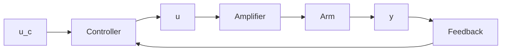

# Example 1.2 Controlling the arm of a disk drive

A schematic diagram of a disk-drive assembly is shown in Fig. 1.5. Let J be the moment of inertia of the arm assembly. The dynamics relating the position y of the arm to the voltage u of the drive amplifier is approximately described by the transfer function

$$G (s) = \frac {k}{J s ^ {2}} \tag {1.1}$$

where k is a constant. The purpose of the control system is to control the position of the arm so that the head follows a given track and that it can be rapidly moved to a different track. It is easy to find the benefits of improved control. Better trackkeeping allows narrower tracks and higher packing density. A faster control system reduces the search time. In this example we will focus on the search problem, which is a typical servo problem. Let $u_{r}$ be the command signal and denote Laplace transforms with capital letters. A simple servo controller can be described by

$$U (s) = \frac {b K}{a} U _ {c} (s) - K \frac {s + b}{s + a} Y (s) \tag {1.2}$$

flowchart

Figure 1.5 A system for controlling the position of the arm of a disk drive.

  
Figure 1.6 Simulation of the disk arm servo with analog (dashed) and computer control (solid). The sampling period is $h = 0.2/\omega_{0}$ .

This controller is a two-degree-of-freedom controller where the feedback from the measured signal is simply a lead-lag filter. If the controller parameters are chosen as

$$\alpha = 2 \omega_ {0}b = \omega_ {0} / 2K = 2 \frac {J \omega_ {0} ^ {2}}{k}$$

a closed system with the characteristic polynomial

$$P (s) = s ^ {3} + 2 \omega_ {0} s ^ {2} + 2 \omega_ {0} ^ {2} s + \omega_ {0} ^ {3}$$

is obtained. This system has a reasonable behavior with a settling time to 5% of $5.52/\omega_{0}$ . See Fig. 1.6. To obtain an algorithm for a computer-controlled system, the control law given by (1.2) is first written as

$$U (s) = \frac {b K}{a} U _ {c} (s) - K Y (s) + K \frac {a - b}{s + a} Y (s) = K \left(\frac {b}{a} U _ {c} (s) - Y (s) + X (s)\right)$$

This control law can be written as

$$u (t) = K \left(\frac {b}{a} u _ {c} (t) - y (t) + x (t)\right) \tag {1.3}\frac {d x}{d t} = - a x + (a - b) y$$
