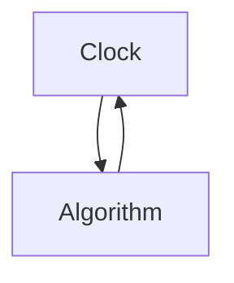

To obtain an algorithm for a control computer, the derivative dx/dt is approximated with a difference. This gives

$$\frac {x (t + h) - x (t)}{h} = - a x (t) + (a - b) y (t)$$


<details>
<summary>flowchart</summary>


</details>

Figure 1.7 Scheduling a computer program.

The following approximation of the continuous algorithm (1.3) is then obtained:

$$u (t _ {k}) = K \left(\frac {b}{a} u _ {c} (t _ {k}) - y (t _ {k}) + x (t _ {k})\right) \tag {1.4}x \left(t _ {k} + h\right) = x \left(t _ {k}\right) + h \left((a - b) y \left(t _ {k}\right) - a x \left(t _ {k}\right)\right)$$

This control law should be executed at each sampling instant. This can be accomplished with the following computer program.

```txt
y: = adin(in2) {read process value}
u:=K*(a/b*uc-y+x).
dout(u) {output control signal}
newx:=x+h*((a-b)*y-a*x) 
```
