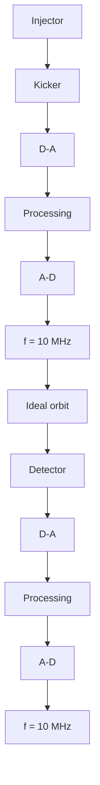

# Example 1.13 Internal-combustion engines

An internal-combustion engine is a sampled system. The ignition can be viewed as a clock that synchronizes the operation of the engine. A torque pulse is generated at each ignition.

flowchart

Figure 1.14 Particle accelerator with stochastic cooling.
