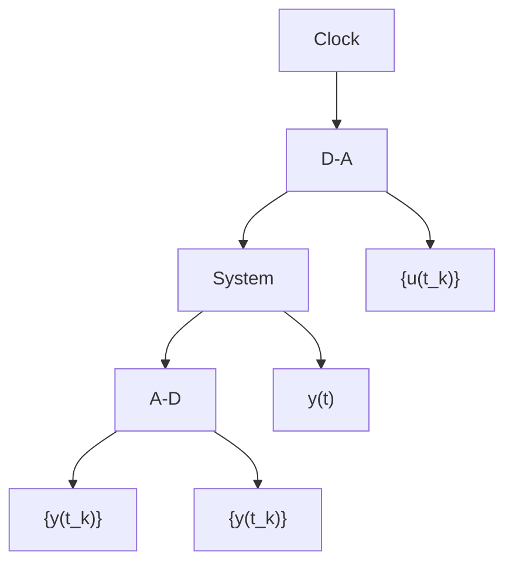

# Zero-Order-Hold Sampling of a System

A common situation in computer control is that the D-A converter is so constructed that it holds the analog signal constant until a new conversion is commanded. This is often called a zero-order-hold circuit. It is then natural to choose the sampling instants, $t_k$ , as the times when the control changes. Because the control signal is discontinuous, it is necessary to specify its behavior at the discontinuities. The convention that the signal is continuous from the right is adopted. The control signal is thus represented by the sampled signal $\{u(t_k): k = \ldots, -1, 0, 1, \ldots\}$ . The relationship between the system variables at the sampling instants will now be determined. Given the state at the sampling time $t_k$ , the state at some future time $t$ is obtained by solving (2.1). The state at time $t$ , where $t_k \leq t \leq t_{k+1}$ , is thus given by

flowchart

Figure 2.1 Block diagram of a continuous-time system connected to A-D and D-A converters.

$$
\begin{array}{l} x (t) = e ^ {A \left(t - t _ {k}\right)} x \left(t _ {k}\right) + \int_ {t _ {j}} ^ {t} e ^ {A \left(t - s ^ {\prime}\right)} B u \left(s ^ {\prime}\right) d s ^ {\prime} \\ = e ^ {A (t - t _ {k})} x \left(t _ {k}\right) + \int_ {t _ {k}} ^ {t} e ^ {A \left(t - s ^ {\prime}\right)} d s ^ {\prime} B u \left(t _ {k}\right) \tag {2.2} \\ = e ^ {A (t - t _ {h})} x (t _ {k}) + \int_ {0} ^ {t - t _ {h}} e ^ {A s} d s B u (t _ {k}) \\ = \Phi (t, t _ {k}) x (t _ {k}) + \Gamma (t, t _ {k}) u (t _ {k}) \\ \end{array}
$$

The second equality follows because u is constant between the sampling instants.

The state vector at time t is thus a linear function of $x(t_{k})$ and $u(t_{k})$ . If the A-D and D-A converters in Fig. 2.1 are perfectly synchronized and if the conversion times are negligible, the input u and the output y can be regarded as being sampled at the same instants. The system equation of the sampled system at the sampling instants is then
