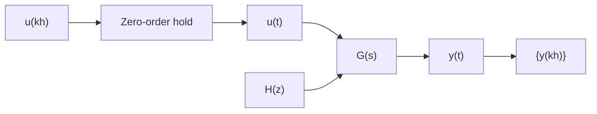

# Computation of the Pulse-Transfer Function

The pulse-transfer function can be determined directly from the continuous-time transfer function. Let the system be described by the transfer function $G(s)$ preceded by a zero-order hold (see Fig. 2.4). The pulse-transfer function is uniquely determined by the response to a given signal. Consider, for instance, a unit-step input. The sequence $\{u(kh)\}$ is then a sequence of ones and the signal $u(t)$ is then also a unit step. Let $Y(s)$ denote the Laplace transform of $y(t)$ , that is,

flowchart

Figure 2.4 Sampling a continuous-time system.

$$Y (s) = \frac {G (s)}{s}$$

Let the sampled output $\{y(kh)\}$ have the z-transform $\tilde{Y} = Z\{L^{-1}Y\}$ . Division of $\tilde{Y}$ by the pulse-transfer function of the input, which is $z/(z-1)$ , gives

$$H (z) = \left(1 - z ^ {- 1}\right) \bar {Y} (z)$$

The pulse-transfer function is now obtained as follows:

1. Determine the step response of the system with the transfer function $G(s)$ .   
2. Determine the corresponding z-transform of the step response.   
3. Divide by the z-transform of the step function.

By using this procedure the following formula can be derived:

$$H (z) = \frac {z - 1}{z} \frac {1}{2 \pi i} \int_ {\gamma - i \infty} ^ {\gamma + i \infty} \frac {e ^ {s h}}{z - e ^ {s h}} \frac {G (s)}{s} d s \tag {2.30}$$

If the transfer function $G(s)$ goes to zero at least as fast as $|s|^{-1}$ for a large $s$ and has distinct poles, none of which are at the origin, we get

$$H (z) = \sum_ {s = s _ {t}} \frac {1}{z - e ^ {s h}} \operatorname{Res} \left\{\frac {e ^ {s h} - 1}{s} \right\} G (s) \tag {2.31}$$

where $s_{i}$ are the poles of $G(s)$ and Res denotes the residue. A proof of this formula is given in Sec. 7.8. If $G(s)$ has multiple poles or a pole in the origin, (2.31) must be modified to take multiple poles into consideration when calculating the residues. Table 2.3 shows some time functions and the corresponding Laplace and z-transforms. The table can thus be used to combine steps 1 and 2. Tables in textbooks are usually found in this form.

Warning. Notice that Zf in Table 2.3 does not give the zero-order-hold sampling of a system with the transfer function Lf. Examine Table 2.1. It is a very common mistake to believe that it does. The desired pulse-transfer function is obtained through the procedure given.
