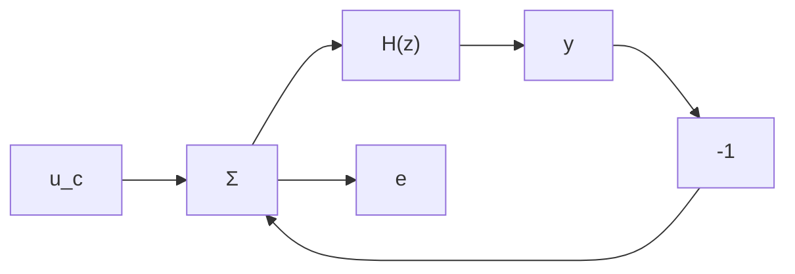

# The Nyquist Criterion

The Nyquist criterion is a well-known stability test for continuous-time systems. It is based on the principle of arguments. The Nyquist criterion is especially useful for determining the stability of the closed-loop system when the open-loop system is given. The test can easily be reformulated to handle discrete-time systems.

Consider the discrete-time system in Fig. 3.5. The closed-loop system has the pulse-transfer function

$$H _ {c l} (z) = \frac {Y (z)}{U _ {c} (z)} = \frac {H (z)}{1 + H (z)}$$

line

| Real axis | Imaginary axis (Solid Line) | Imaginary axis (Dashed Line) |
| --- | --- | --- |
| -0.5 | ~0.0 | ~0.0 |
| 0.0 | ~-0.8 | ~-0.6 |
| 0.5 | ~-0.7 | ~-0.5 |
| 1.0 | ~0.0 | ~0.0 |

Figure 3.3 The frequency curve of (3.6) (dashed) and for (3.6) sampled with zero-order hold when h = 0.4 (solid).

line

| Frequency, rad/s | Gain (Solid Line) | Gain (Dashed Line) | Phase (Solid Line) | Phase (Dashed Line) |
| --- | --- | --- | --- | --- |
| 0.1 | 1.0 | 1.0 | 0.0 | 0.0 |
| 1.0 | ~0.5 | ~0.5 | ~-50 | ~-50 |
| 10.0 | ~0.01 | ~0.01 | ~-180 | ~-180 |

Figure 3.4 The Bode diagram of (3.6) (dashed) and of (3.6) sampled with zero-order hold when h = 0.4 (solid).

flowchart

Figure 3.5 A simple unit-feedback system.

The characteristic equation of the closed-loop system is

$$1 + H (z) = 0 \tag {3.7}$$
