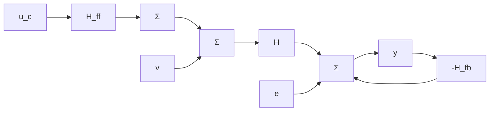

# Sensitivity

We will first determine the sensitivity of a closed-loop system with respect to changes in the open-loop pulse-transfer function. Consider the system in Fig. 3.10. The closed-loop system has a feedforward filter $H_{ff}$ from the reference signal and a feedback controller $H_{fb}$ . There are also an input load disturbance v and measurement noise e. The primary process output is x, and the measured signal is y. The pulse-transfer operator from the inputs to y is given by

$$y = \frac {H _ {f f} H}{1 + L} u _ {c} + \frac {H}{1 + L} v + \frac {1}{1 + L} e$$

where the loop-transfer function is defined as $L = H_{fb}H$ . The closed-loop pulse-

flowchart

Figure 3.10 Closed-loop system with feedback and feedforward controllers.

transfer function from the reference signal $u_{c}$ to the output y is

$$H _ {c l} = \frac {H _ {f f} H}{1 + L}$$

The sensitivity of $H_{c,i}$ with respect to variations in H is given by

$$\frac {d H _ {c l}}{d H} = \frac {H _ {f f}}{(1 + L) ^ {2}}$$

The relative sensitivity of $H_{cl}$ with respect to H thus can be written as

$$\frac {d H _ {c l}}{H _ {c l}} = \frac {1}{1 + L} \frac {d H}{H} = S \frac {d H}{H}$$

The pulse-transfer function S is called the sensitivity function and also can be written as

$$S = \frac {1}{1 + L} = \frac {d \log H _ {c l}}{d \log H} \tag {3.10}$$

The transfer function

$$\mathcal {T} = 1 - \mathcal {S} = \frac {\mathcal {L}}{1 + \mathcal {L}} \tag {3.11}$$

is called the complementary sensitivity function.

The different transfer functions from the inputs $u_{c}, v,$ and e to the signals y, x, and u show how the different signals are influenced by the input signals. The sensitivity function can be interpreted as the pulse-transfer function from e to y or as the ratio of the closed-loop and open-loop pulse-transfer functions from v to y. The complementary sensitivity function is the pulse-transfer function with opposite sign from e to x.
