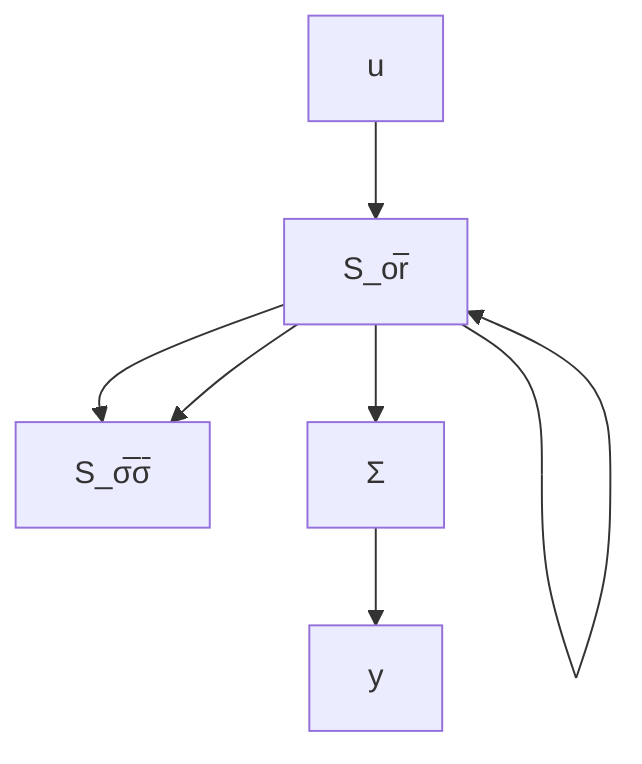

# Kalman's Decomposition

The reachable and the unobservable parts of a system are two linear subspaces of the state space. Both subspaces are independent of the coordinates in the state space. Kalman showed that it is possible to introduce coordinates such that a system can be partitioned in the following way:

$$
\begin{array}{l} x (k + 1) = \left( \begin{array}{c c c c} \Phi_ {1 1} & \Phi_ {1 2} & 0 & 0 \\ 0 & \Phi_ {2 2} & 0 & 0 \\ \Phi_ {3 1} & \Phi_ {3 2} & \Phi_ {3 3} & \Phi_ {3 4} \\ 0 & \Phi_ {4 2} & 0 & \Phi_ {4 4} \end{array} \right) x (k) + \left( \begin{array}{c} \Gamma_ {1} \\ 0 \\ \Gamma_ {3} \\ 0 \end{array} \right) u (k) \\ y (k) = \left( \begin{array}{c c c c} C _ {1} & C _ {2} & 0 & 0 \end{array} \right) x (k) \\ \end{array}
$$

where $\Phi_{ij}$ , $\Gamma_{i}$ , and $C_{i}$ are matrices of suitable orders. The state space is partitioned into four parts, which correspond to states that are reachable and observable, not reachable but observable, reachable and not observable, and neither reachable nor observable.

By simple algebraic manipulations, the pulse-transfer operator is given by

$$H (q) = C _ {1} \left(q I - \Phi_ {1 1}\right) ^ {- 1} \Gamma_ {1}$$

The pulse-transfer operator is thus determined by the reachable and observable part of the system. The following theorem summarizes these results.

THEOREM 3.9 KALMAN'S DECOMPOSITION A linear system can be partitioned into four subsystems with the following properties:

$S_{or}$ Observable and reachable subsystem   
$S_{o\bar{r}}$ Observable but not reachable subsystem   
$S_{\bar{o}r}$ Not observable but reachable subsystem   
$S_{\delta \bar{r}}$ Neither observable nor reachable subsystem

flowchart

Figure 3.12 Block diagram of the Kalman decomposition when the system is diagonalizable.

Further, the pulse-transfer function of the system is uniquely determined by the subsystem that is both observable and reachable.

A block diagram for the decomposition is given in Fig. 3.12, which shows how the subsystems are interconnected. The figure also shows that the input-output relationship is given only by the subsystem $S_{0r}$ .
