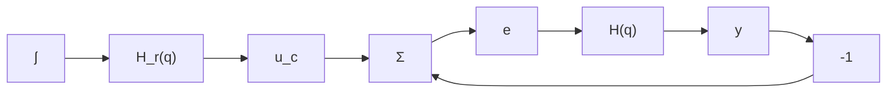

# Simple Disturbance Models

There are four different types of disturbances—impulse, step, ramp, and sinusoid—that are commonly used in analyzing control systems. These disturbances are illustrated in Fig. 3.13 and a discussion of their properties follows.

The impulse and the pulse. The impulse and the pulse are simple idealizations of sudden disturbances of short duration. They can represent load disturbances as well as measurement errors. For continuous systems, the disturbance is an impulse (a delta function); for sampled systems, the disturbance is modeled as a pulse with unit amplitude and a duration of one sampling period.

  
Figure 3.13 Idealized models of simple disturbances.

flowchart

Figure 3.14 Generation of the reference value using a dynamic system with a pulse input.

The pulse and the impulse are also important for theoretical reasons because the response of a linear continuous-time system is completely specified by its impulse response and a linear discrete-time system by its pulse response.

The step. The step signal is another prototype for a disturbance (see Fig. 3.13). It is typically used to represent a load disturbance or an offset in a measurement.

The ramp. The ramp is a signal that is zero for negative time and increases linearly for positive time (see Fig. 3.13). It is used to represent drifting measurement errors and disturbances that suddenly start to drift away. In practice, the disturbances are often bounded; however, the ramp is a useful idealization.

The sinusoid. The sine wave is the prototype for a periodic disturbance. Choice of the frequency makes it possible to represent low-frequency load disturbances, as well as high-frequency measurement noise.

Generation of disturbances. It is convenient to view disturbances as being generated by dynamic systems (see Fig. 3.14). It is assumed that the input to the dynamic system is a unit pulse $\delta_{k}$ , that is,

$$u _ {r} (k) = H _ {r} (q) \delta_ {k}$$
