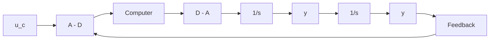

# Control of the Double Integrator

The double integrator (Example A.1) will be used as the main example to show how the closed-loop behavior is changed with different controllers. The pulse-transfer operator of the double integrator for the sampling period h = 1 is

$$H _ {0} (q) = \frac {0 . 5 (q + 1)}{(q - 1) ^ {2}} \tag {3.25}$$

Assume that the purpose of the control is to make the output follow changes in the reference value. Also assume that the process is controlled by a computer using proportional feedback, that is,

$$u (k) = K \left(u _ {c} (k) - y (k)\right) = K e (k) \quad K > 0$$

scatter

| Real axis | Imaginary axis |
| --- | --- |
| -1.0 | 0.0 |
| 1.0 | 0.0 |
| -1.0 | 2.0 |
| 1.0 | -2.0 |

Figure 3.15 The root locus of (3.26) when K > 0.

where $u_{c}$ is the reference value. The characteristic equation of the closed-loop system is

$$(q - 1) ^ {2} + 0. 5 K (q + 1) = q ^ {2} + (0. 5 K - 2) q + 1 + 0. 5 K = 0 \tag {3.26}$$

Jury's stability test (compare with Example 3.2) gives the following conditions for stability:

$$
\begin{array}{l} 1 + 0. 5 K <   1 \\ 1 + 0. 5 K > - 1 + 0. 5 K - 2 \\ 1 + 0. 5 K > - 1 - 0. 5 K + 2 \\ \end{array}
$$

The closed-loop system is unstable for all values of the gain $K$ . The root locus is shown in Fig. 3.15.

To get a stable system, the controller must be modified. It is known from continuous-time synthesis that derivative action improves stability, so proportional and derivative feedback can be tried also for the discrete-time system. We now assume that it is possible to measure and sample the velocity y and use that for feedback; that is,

$$u (k) = K \left(e (k) - T _ {d} \dot {y} (k)\right) \tag {3.27}$$

(see Fig. 3.16). To find the input-output model of the closed-loop system with

flowchart

Figure 3.16 Discrete-time controller with feedback from position and velocity of the double integrator.

the controller (3.27), observe that

$$\frac {d \dot {y}}{d t} = u$$

Because $u$ is constant over the sampling intervals,

$$\dot {y} (k + 1) - \dot {y} (k) = u (k)$$

or

$$\dot {y} (k) = \frac {1}{q - 1} u (k) \tag {3.28}$$
