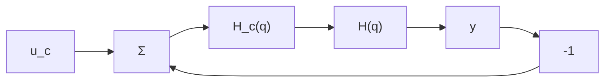

# 3.6 Problems

3.1 Determine if the following equations have all their roots inside the unit disc:

(a) $z^2 - 1.5z + 0.9 = 0$   
(b) $z^3 - 3z^2 + 2z - 0.5 = 0$   
(c) $z^3 - 2z^2 + 2z - 0.5 = 0$   
(d) $z^3 + 5z^2 - 0.25z - 1.25 = 0$   
(e) $z^3 - 1.7z^2 + 1.7z - 0.7 = 0$

3.2 Consider the system in Fig. 3.5 and let

$$H (z) = \frac {K}{z (z - 0 . 2) (z - 0 . 4)} \quad K > 0$$

Determine the values of K for which the closed-loop system is stable.

3.3 Consider the system in Fig. 3.21. Assume that the sampling is done periodically with the period h and that the D-A converter holds the control signal constant over the sampling interval. The control algorithm is assumed to be

flowchart

Figure 3.21 Closed-loop system for Problem 3.3.

$$u (k h) = K \left(u _ {c} (k h - \tau) - y (k h - \tau)\right)$$

where K > 0 and $\tau$ is the computation time. The transfer function of the process is

$$G (s) = \frac {1}{s}$$

(a) How large are the values of the regulator gain, $K$ , for which the closed-loop system is stable if $\tau = 0$ and $\tau = h$ ?

(b) Compare this system with the corresponding continuous-time systems, that is, when there is a continuous-time proportional controller and a time delay in the process.

3.4 Determine the Nyquist curve for the system

$$H (z) = \frac {1}{z - 0 . 5}$$

3.5 From the system

$$
x (k + 1) = \left( \begin{array}{l l} 1 & 0 \\ 1 & 1 \end{array} \right) x (k) + \left( \begin{array}{l} 1 \\ 0 \end{array} \right) u (k)

y (k) = \left( \begin{array}{c c} 0 & 1 \end{array} \right) x (k)
$$

the following values are obtained

$$y (1) = 0 \quad u (1) = 1y (2) = 1 \quad u (2) = - 1$$

Determine the value of the state at k = 3.

3.6 Is the following system (a) observable, (b) reachable?

$$
x (k + 1) = \left( \begin{array}{c c} 0. 5 & - 0. 5 \\ 0 & 0. 2 5 \end{array} \right) x (k) + \binom {6} {4} u (k)

y (k) = \left( \begin{array}{c c} 2 & - 4 \end{array} \right) x (k)
$$

3.7 Is the following system reachable?

$$
x (k + 1) = \left( \begin{array}{c c} 1 & 0 \\ 0 & 0. 5 \end{array} \right) x (k) + \left( \begin{array}{c c} 1 & 1 \\ 1 & 0 \end{array} \right) u (k)
$$

Assume that a scalar input $u'(k)$ such that

$$u (k) = \binom{1}{- 1} u ^ {\prime} (k)$$

is introduced. Is the system reachable from $u'(k)$ ?

3.8 Given the system
