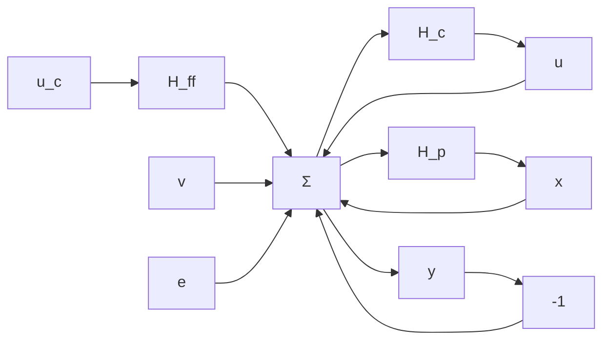

It is difficult to find design methods that consider all the preceding issues mentioned. Most design methods focus on one or two aspects of the problem and the control-system designer then has to check that the other requirements are also satisfied. To do this it is necessary to consider the signal transmission from command signals, load disturbances, and measurement noise to process variables, measured signals, and control signals. This is illustrated in the block diagram of Fig. 4.1. Compare with Fig. 3.10. In this chapter we will develop a design method based on state models whose purpose is to obtain a specified closed-loop characteristic polynomial of the system. At first sight it may seem unnatural to specify the problem in this way. It will lead, however, to simple design methods that will give considerable insight into the structure of good control systems. The design method is very easy to apply for low-order systems, but it may be difficult to choose the poles properly for systems of high order. The structure of the controller is also the same as the one obtained with more sophisticated design methods, which will be discussed later.

flowchart

Figure 4.1 Block diagram of a typical control system.

We will start with a simple design problem and gradually make it more and more realistic. The problem is specified as follows.

The process. It is assumed that the process to be controlled can be described by the model

$$\frac {d x}{d t} = A x + B u \tag {4.1}$$

where u represents the control variables, x represents the state vector, and A and B are constant matrices. Further, only the single-input-single-output case will be discussed. Because computer control is considered, the control signals will be constant over sampling periods of constant length. Sampling the system in Eq. (4.1) by the methods described in Sec. 2.3 gives the discrete-time system

$$x (k h + h) = \Phi x (k h) + \Gamma u (k h)$$

where the matrices $\Phi$ and $\Gamma$ are given by

$$\Phi = e ^ {A h} \quad \Gamma = \int_ {0} ^ {h} e ^ {A s} d s B$$

To simplify we will write the system as

$$x (k + 1) = \Phi x (k) + \Gamma u (k) \tag {4.2}$$
