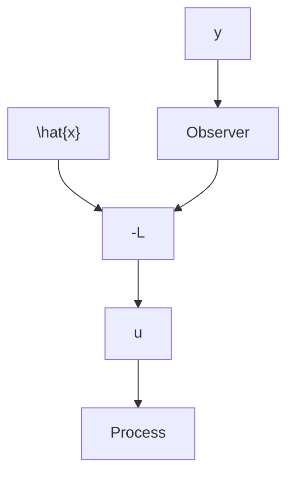

# 4.5 Output Feedback

In Sec. 4.3 the pole-placement problem was solved in the special case when all state variables are measured directly. In Sec. 4.4 the problem of finding the states from the system output was solved. It is now natural to combine the results of these sections to obtain a solution to the pole-placement problem for the case of output feedback. Let the system be described by

$$
\begin{array}{l} x (k + 1) = \Phi x (k) + \Gamma u (k) \\ y (k) = C x (k) \tag {4.33} \\ \end{array}
$$

A linear feedback law relating u to y such that the closed-loop system has given poles is desired. The disturbances are first assumed to be impulses or equivalently unknown initial states.

flowchart

Figure 4.6 Block diagram of a controller obtained by combining state feedback with an observer.

The admissible control law is such that $u(k)$ is a function of $y(k - 1), y(k - 2), \ldots, u(k - 1), u(k - 2), \ldots$ . If all state variables are measured, it is shown in Sec. 4.3 that the feedback

$$u (k) = - L x (k)$$

gives the desired poles. When the state cannot be measured, it seems intuitively reasonable to use the control law

$$u (k) = - L \hat {x} (k \mid k - 1) \tag {4.34}$$

where $\hat{x}$ is obtained from the observer

$$\hat {x} (k + 1 \mid k) = \Phi \hat {x} (k \mid k - 1) + \Gamma u (k) + K \left(y (k) - C \hat {x} (k \mid k - 1)\right) \tag {4.35}$$

Thus the feedback is a dynamic system of order n. Notice that the dynamics are due to the dynamics of the observer. A block diagram of the feedback is shown in Fig. 4.6.
