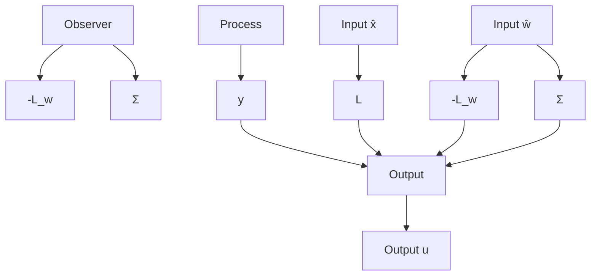

# Integral Action

The special case of a constant but unknown disturbance acting on the process input is very common. It leads to a solution where the controller has integral action. To see this consider the case of a system with a single input and a constant disturbance at the process input. In this case we have w = v and $\Phi_{w} = 1$ . In addition if the disturbance acts on the process input we get $\Phi_{xw} = \Gamma$ . It then follows from Eq. (4.43) that $L_{w} = 1$ gives perfect cancellation of the load disturbance. Assuming that there are no measurement errors the controller described by Eqs. (4.40) to (4.42) becomes

flowchart

Figure 4.8 Block diagram of a controller with state feedback from estimated disturbance states.

$$u (k) = - L \hat {x} (k) - L _ {w} \hat {v} (k) = - L \hat {x} (k) - \hat {v} (k)\hat {x} (k + 1) = \Phi \hat {x} (k) + \Gamma (\hat {v} (k) + u (k)) + K \varepsilon (k) \tag {4.44}\hat {v} (k + 1) = \hat {v} (k) + K _ {w} \varepsilon (k)\varepsilon (k) = y (k) - C \hat {x} (k)$$

Notice that the estimation of the disturbance is obtained simply by integrating the error of the state estimate. A block diagram of this controller is shown in Fig. 4.9. The diagram shows clearly how the disturbance v is reduced by its estimate $\hat{v}$ , which is obtained by integrating the observer error. There is an integrator in the disturbance observer. In Fig. 4.9 there is, however, feedback around the integrator. To see more clearly that the controller has integral action Eq. (4.44) is rewritten as

$$u (k) = - L \hat {x} (k) - \hat {v} (k)\hat {x} (k + 1) = (\Phi - \Gamma L) \hat {x} (k) + K (y (k) - C \hat {x} (k))\hat {v} (k + 1) = \hat {v} (k) + K _ {w} \left(y (k) - C \hat {x} (k)\right)$$

Notice that the estimate $\hat{x}$ of the process state is the same as in the case when there are no disturbances; compare with Eq. (4.28). We now introduce

$$H _ {x} (z) = \left(z I - \Phi + \Gamma L + K C\right) ^ {- 1} K \tag {4.45}$$

flowchart

