```mermaid
graph TD
    A["State Observer"] --> B["Disturbance Observer"]
    B --> C["Σ"]
    C --> D["Process"]
    D --> E["y"]
    E --> F["Σ"]
    F --> G["Σ"]
    G --> H["Σ"]
    H --> I["u"]
    I --> J["v"]
    J --> K["Process"]
    K --> L["Σ"]
    L --> M["Σ"]
    M --> N["Σ"]
    N --> O["Σ"]
    O --> P["Σ"]
    P --> Q["Σ"]
    Q --> R["Σ"]
    R --> S["Σ"]
    S --> T["Σ"]
    T --> U["Σ"]
    U --> V["Σ"]
    V --> W["Σ"]
    W --> X["Σ"]
    X --> Y["Σ"]
    Y --> Z["Σ"]
    Z --> A
    style A fill:#f9f,stroke:#333
    style B fill:#f9f,stroke:#333
    style C fill:#ccf,stroke:#333
    style D fill:#ccf,stroke:#333
    style E fill:#dfd,stroke:#333
    style F fill:#dfd,stroke:#333
    style G fill:#dfd,stroke:#333
    style H fill:#dfd,stroke:#333
    style I fill:#dfd,stroke:#333
    style J fill:#dfd,stroke:#333
    style K fill:#dfd,stroke:#333
    style L fill:#dfd,stroke:#333
    style M fill:#dfd,stroke:#333
    style N fill:#dfd,stroke:#333
    style O fill:#dfd,stroke:#333
    style P fill:#dfd,stroke:#333
    style Q fill:#dfd,stroke:#333
    style R fill:#dfd,stroke:#333
    style S fill:#dfd,stroke:#333
```

Figure 4.9 Block diagram of a controller with state feedback and an observer with integral action. The pulse-transfer function of the disturbance observer is $K_{w} / (z - 1)$ .

$LH_{x}(z)$ is the transfer function of the controller for a system with state feedback given by Eq. (4.37). The input-output relation of the controller (4.44) is then

$$U (z) = - \left[ L H _ {x} (z) + \frac {1}{z - 1} K _ {w} \Big (I - C H _ {x} (z) \Big) \right] Y (z) \tag {4.46}$$

The expression shows that the controller has integral action. Notice that integral action is obtained through the observer that estimates a constant disturbance acting on the process input. We will illustrate by an example.
