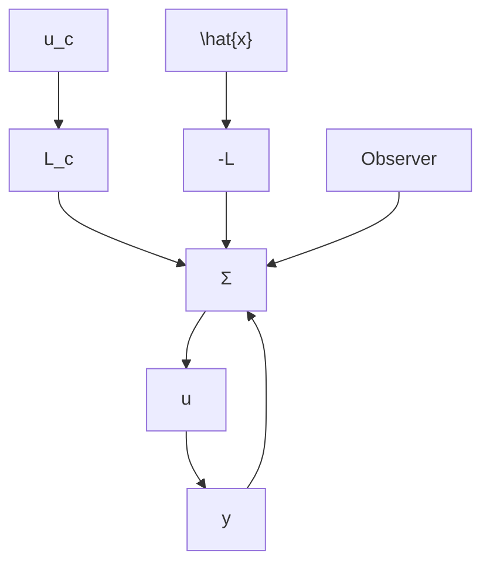

# A Naive Approach

A simple way to obtain the desired response to command signals is to replace the regular state feedback $u(k) = -L\hat{x}(k)$ by

$$u (k) = - L \hat {x} (k) + L _ {c} u _ {c} (k) \tag {4.47}$$

where $u_{c}$ is the command signal. To investigate the response of such a controller we consider the closed-loop system that is described by

$$
\begin{array}{l} x (k + 1) = \Phi x (k) + \Gamma u (k) \\ y (k) = C x (k) \\ \hat {x} (k + 1) = \Phi \hat {x} (k) + \Gamma u (k) + K (y (k) - C \hat {x} (k)) \tag {4.48} \\ u (k) = - L \hat {x} (k) + L _ {c} u _ {c} (k) \\ \end{array}
$$

A block diagram of the system is shown in Fig. 4.11. Eliminating u and introducing the estimation error $\tilde{x} = x - \hat{x}$ we find that the closed-loop system can

flowchart

Figure 4.11 Block diagram that shows a simple way of introducing command signals in a controller with state feedback and an observer.

be described by

$$x (k + 1) = (\Phi - \Gamma L) x (k) + \Gamma L \tilde {x} (k) + \Gamma L _ {c} u _ {c} (k)\tilde {x} (k + 1) = (\Phi - K C) \tilde {x} (k) \tag {4.49}y (k) = C x (k)$$

Notice that the observer error is not reachable from $u_{c}$ . This makes sense because it would be highly undesirable to introduce command signals in such a way that they will cause observer errors.

It follows from Eq. (4.49) that the pulse transfer from the command signal to the process output is given by

$$H _ {c l} (z) = C (z I - \Phi + \Gamma L) ^ {- 1} \Gamma L _ {c} = L _ {c} \frac {B (z)}{A _ {m} (z)} \tag {4.50}$$

This can be compared with the pulse-transfer function of the process

$$H (z) = C (z I - \Phi) ^ {- 1} \Gamma = \frac {B (z)}{A (z)} \tag {4.51}$$

The fact that the polynomial $B(z)$ appears in the numerator of both transfer functions can be seen by transforming both systems to reachable canonical form. Compare with the derivation of Ackermann's formula given by Eq. (4.14).

The closed-loop system obtained with the control law given by Eq. (4.47) has the same zeros as the plant and its poles are the eigenvalues of the matrix $\Phi - \Gamma L$ . From the previous discussion we have found that the rejection of disturbances are also influenced by $L$ . Sometimes it is desirable to have a controller where disturbance rejection and command signal response are totally independent. To obtain this we will use a more general controller structure that is discussed later. Before doing this we will show how to introduce integral action in the controller (4.47).
