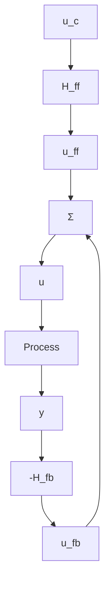
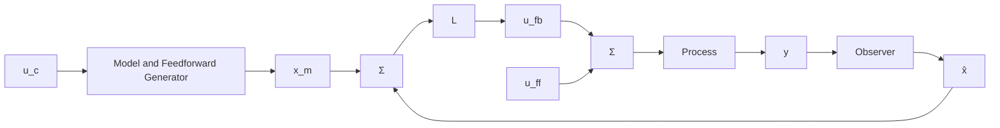

# A Two-Degree-of-Freedom Controller

Practical control systems often have specifications that involve both servo and regulation properties. This is traditionally solved using a two-degree-of-freedom structure, as shown in Fig. 4.12. Compare with Fig. 3.10. This configuration has the advantage that the servo and regulation problems are separated. The feedback controller $H_{fb}$ is designed to obtain a closed-loop system that is insensitive to process disturbances, measurement noise, and process uncertainties. The feedforward compensator $H_{ff}$ is then designed to obtain the desired servo properties. We will now show how to solve the servo problem in the context of state feedback.

flowchart

Figure 4.12 Block diagram of a feedback system with a two-degree-of-freedom structure.

flowchart

Figure 4.13 A two-degree-of-freedom controller based on state feedback and an observer.
