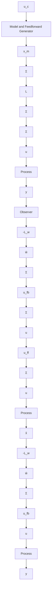

# Putting It All Together

By combining the solutions to the regulation and servo problems we have a powerful controller, which is described by

$$u (k) = u _ {f f} (k) + u _ {f b} (k)u _ {f f} (k) = \lambda \left(u _ {c} (k) + C _ {f f} x _ {m} (k)\right)u _ {f b} (k) = L \left(x _ {m} (k) - \hat {x} (k)\right) - L _ {w} \hat {w} (k)\hat {x} (k + 1) = \Phi \hat {x} (k) + \Phi_ {x w} \hat {w} (k) + \Gamma u (k) + K \varepsilon (k) \tag {4.61}\hat {w} (k + 1) = \Phi_ {w} \hat {w} (k) + K _ {w} \varepsilon (k)\varepsilon (k) = y (k) - C \hat {x} (k)x _ {m} (k + 1) = \Phi_ {m} x _ {m} (k) + \Gamma_ {m} u _ {c} (k)$$

This controller captures many aspects of a control problem such as load-disturbance attenuation, reduction of effects of measurement noise, and command signal following. The responses to load disturbances, command signals, and measurement noise are completely separated. The command signal response is determined by the reference model. The response to load disturbances and measurement noise is influenced by the observer and the state feedback. It can be adjusted by the matrices $L$ , $L_{w}$ , K, and $K_{w}$ . The fact that all estimated states are compared with their desired behavior gives a good possibility to exercise accurate control. A block diagram of the closed-loop system is shown in Fig. 4.14.

The controller given by Eq. (4.61) can be represented in many different ways. All representations are equivalent because the system is linear and time-invariant. In practice it is useful to use nonlinear reference models, actuators and converters may be nonlinear, and there may be nonlinear effects in the computations such as roundoff. In such cases the different structures may have drastically different properties.

flowchart

